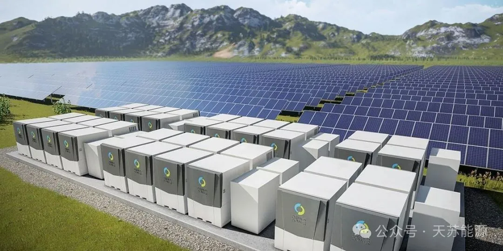
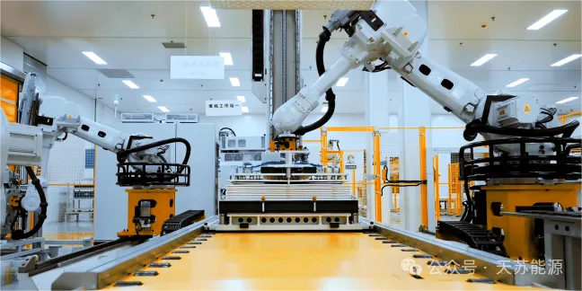
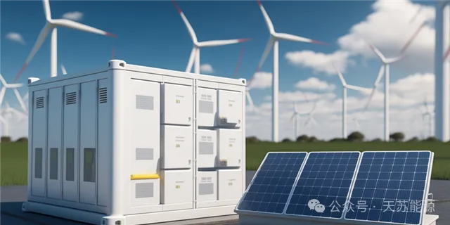
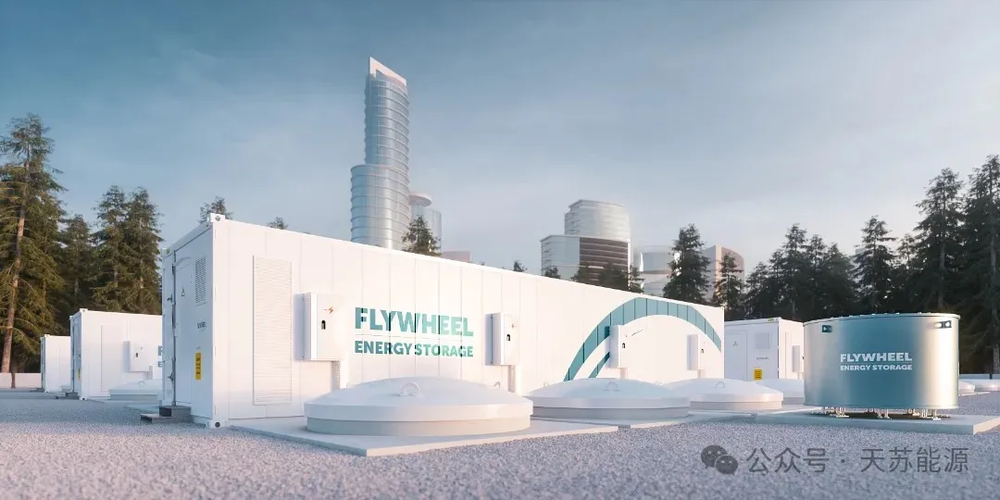
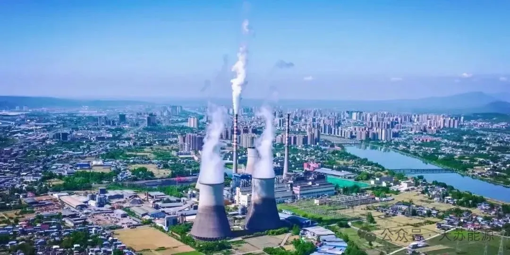
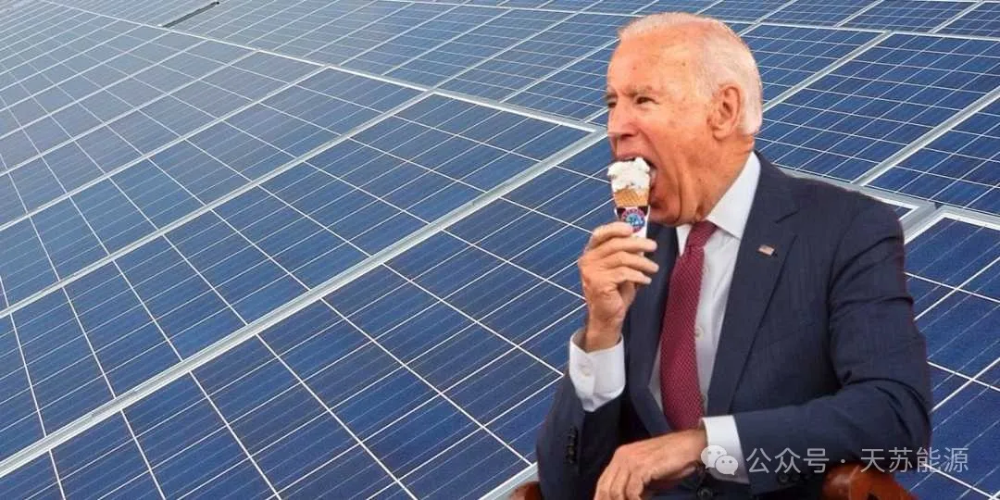

**天苏十条 | 2024.5.13-5.19  第十六期**

> 第十六期中，“天苏十条”持续关注能源领域最新近况，目前有关储能领域变革措施陆续出台，降本增效与技术创新成为双重驱动力，绿色储能，清洁低碳逐步成为全球化趋势，其中电池储能迅猛发展，屡破新高，成为储能行业中一大亮点。

## **一、国务院部署先进储能等战略性前沿技术**

据国务院国资委官网消息，国务院国资委党委召开扩大会议，会议认为，中央企业是保障我国能源安全的国家队、主力军，要进一步提高政治站位，**坚持先立后破，深入推进能源革命，加强煤炭清洁高效利用，加快规划建设新能源体系，**加大油气勘探开发力度，推动油气增储上产，加快天然气产供储销体系建设，提高煤电基础保障水平， **持续加大非化石能源的规模开发和综合利用，确保能源供应安全稳定。**

会议指出，要推动能源结构持续优化，充分发挥中央企业优势，做强做优主业、提升效率效益，加快构建**以风电、太阳能发电大基地为主体，集中式与分布式协同发展，氢能、新型储能支撑调节、前沿核心技术引领带动的新能源产业体系**；推动能源科技加快创新，发挥能源技术变革作用，明确能源技术开发应用重点，充分考虑资源条件、技术基础、环境容量、经济合理等因素，集中力量突破一批关键重大技术装备，超前部署研究先进储能等战略性前沿技术；加快建设新能源基础设施，**推进电网基础设施智能化改造和智能微电网建设，着力提高电网对清洁能源的接纳、配置和调控能力**；加大国际能源合作力度，在绿色技术、绿色装备、绿色服务等方面持续深化与各国企业的交流协作，**有序推进新能源产业链合作，着力构建能源绿色低碳转型共赢新模式。**

## **二、首个吉瓦级液流电池工厂投产**

**纬景储能科技有限公司在珠海建设的“超G工厂”已于2023年10月26日全面投产，成为全球首个吉瓦级别的液流电池制造基地。**这个工厂的年产能将**超过6吉瓦时**，位于珠海斗门富山工业园，占地面积18.52万平方米，包含4座厂房及15条自动化生产线。

**该工厂主要生产锌铁液流电池，其产品特点包括长时储能、安全无毒、低成本等。**锌铁液流电池采用碱性电解液，不燃不爆，且全生命周期度电成本较低，能够实现4至8小时的长时储能，满足新型电力系统对储能电池的要求。**纬景储能的“超G工厂”在行业内具有最高的自动化率，**其智能制造产线由堆叠系统、自动压装试漏拧紧系统、托盘自动翻转系统构成，每条产线仅需20分钟即可完成一个成品电池的组装，生产效率提升了数十倍。工厂内超过300个机器人承担着精密和繁重的工作，采用激光定位与视觉定位技术，以及昆虫仿生等先进制造工艺，精准度高达±0.1毫米。

## **三、量子电池理论研究获突破**

近期，中国科学院精密测量科学与技术创新研究院与湖北大学、兰州大学合作，**在量子电池理论研究方面取得了重要进展，并提出了抗老化的远距充电量子电池方案。**这一研究目标是实现具有更小尺寸、更强充电功率、更高充电容量和更大可提取功的新型储供能装置。

量子电池的实现和应用面临一些挑战，如量子电池的老化问题，以及量子电池与充电器间的相干耦合充电方案。为了解决这些挑战，研究团队提出了一种新型量子电池方案，**利用波导中的真空电磁场这一共同环境诱导的非马尔科夫退相干动力学，实现充电器与电池间免受老化影响的持续能量交换。**这一研究成果发表在《物理评论快报》(Physical Review Letters)上，并得到了国家自然科学基金等机构的支持。**这标志着在量子科技领域中，对于变革性储供能装置的研究取得了显著进展，有望为未来能源需求提供新的解决方案。**

## **四、中国储能行业迎来深刻变革**

2024年，**中国储能行业正经历一场深刻的变革，其中降本增效成为行业发展的主旋律。**随着越来越多的企业进入储能市场，竞争日益加剧，导致电池和钣金等材料价格不断下降，进而使得整个市场的招标价格明显降低。**这种市场报价的快速下行给储能企业带来了巨大的成本压力，迫使企业寻求降本增效的途径以保持竞争优势。**

储能行业技术迭代正在加速，例如，300Ah+储能电芯尚未站稳，500Ah+储能电芯已经问世。随着储能电芯单体容量越来越大，储能系统单机容量也在同步扩展，单机5MWh+储能产品正加速推出。这些技术的发展不仅提升了储能系统的效率，还降低了成本，从而推动了整个行业的发展。储能行业在追求降本增效的过程中，不仅需要关注短期成本竞争力，更应注重可持续发展和长期效益。**通过技术创新和政策引导，推动储能行业向高效、环保、安全方向发展，是实现能源转型和绿色低碳发展的关键。**

## **五、新型储能项目预算规定出台**

**中国电力企业联合会近日发布了全国首版《新型储能项目建设预算编制与计算规定(锂离子电池储能电站分册)》。**这一规定的实施标志着锂离子电池储能电站工程建设在造价方面迈出了标准化的新步伐，填补了储能行业在工程造价领域的长期空白，对储能市场的发展起到了重要的推动作用。

该规定由国网宁夏经研院牵头编制，综合考虑了锂离子电池储能项目在工程管理、设计实施、施工作业及工程造价等多个维度的实际情况。在编制过程中，特别针对以往缺乏标准定额依据的特殊工艺费用问题进行了规范，明确了相关费用的具体构成和计算原则。此外，通过典型工程造价水平的测算与对比，实现了预算规定与定额标准的协同调整，确保了各项单项费用与总投资水平的合理性。**此项规定的出台将为锂离子电池储能电站的建设提供更加明确的指导，有助于进一步规范市场秩序，推动储能技术的广泛应用，以适应日益增长的能源需求，促进绿色能源的可持续发展。**

## **六、加州电池储能熨平鸭子曲线**

**4月16日，在加州电网，电池储能在晚间高峰时段内成为人类历史上首次最大的单一电力来源。**加州目前累计拥有10,379MW的电池储能容量。当天18点55分至21点05分，**电池成为单一最大电源，这种情况总共维持了130分钟。**

其中，当天晚上8点10分，创纪录的**6,177MW**电力**从电池储能系统(BESS)资源中输送到加州独立系统运营商(CAISO)电网，超过了可再生能源**(4,603MW)、天然气(5,121MW)、大型水力发电(4,353MW)和能源进口(3,936MW)四大电力来源的即时发电。

## **七、中法电池合作成为新亮点**

**习近平主席此次出访期间，两国多家头部能源企业签订了电池、新能源领域的合作协议。**据星星充电发布消息，法国工业巨头施耐德电气与星星充电签署谅解备忘录，计划成立合资企业，**面向欧洲的电动车和智慧能源设施市场，开发包括充电桩、逆变器、储能系统等产品和解决方案。**

先进核电方面，**在中国台山建设有两座采用法国三代EPR技术的核电站，由中广核控股开发，法国电力公司(EDF)也是该电站的股东方之一**，这一电站是全球第三台开工的EPR核电机组，借助中方成熟的核电工程能力，最终成为首个投产的EPR项目。燃料循环领域，欧安诺(Orano，原阿海珐)一直在与中核集团进行后处理大厂的谈判，已有十余年的历史。

## **八、美对东南亚光伏产品发起双反调查**

5月16日，应美国太阳能制造贸易委员会(American Alliance for Solar Manufacturing Trade Committee)于2024年4月24日提交的申请，**美国商务部宣布对进口自柬埔寨、马来西亚、泰国和越南的晶体硅光伏电池(无论是否组装成模块)发起反倾销和反补贴调查。**

据美方统计，2023年美国自各涉案国家进口被调查产品的金额分别约为：柬埔寨23亿美元、马来西亚19亿美元、泰国37亿美元、越南40亿美元。美国国际贸易管理局官方披露的数据显示，目前柬埔寨所谓的倾销税率为**125.37%**、马来西亚**81.22%**，泰国、越南分别达到**70.36%、271.28%**。倾销率指倾销幅度与课税价格的比率。

## **九、沙特谋求能源经济转型**

从世界经济论坛全球合作增长和能源发展特别会议，到博鳌亚洲论坛利雅得会议(下称利雅得会议)，再到2016年的“2030愿景”，**沙特在不停地进行能源转型的探索。**此后，沙特政府先后发布《萨勒曼国王可再生能源法案》《国家可再生能源计划》等一系列文件，并提出“绿色沙特倡议”和“绿色中东倡议”，以期加快转型步伐。

根据分析机构GlobalData的最新数据，自2022年以来，沙特已经新增了**2.1GW**的可再生能源发电能力，较十年前增长了3倍。**且该国的可再生能源发电量占比正在逐渐提升，**前述机构预测这一占比将由2023年的3.2%提高至2035年的35.4%。在今年COP28大会(《联合国气候变化框架公约》第28次缔约方大会)上，沙特曾旗帜鲜明地反对部分针对减少化石燃料所提出的措辞。

## **十、加拿大最大抽水蓄能遭抵制**

**加拿大安大略省南部的一个市政府正在为 TC Energy 在乔治亚湾建设加拿大迄今为止最大的储能项目-抽水蓄能的提议提供有条件支持，而其他当地城镇和团体则继续反对。**附近的四个市政府已通过反对该项目的动议，安大略省抽水蓄能项目将在夜间电费便宜时将水从乔治亚湾抽入距海岸线 150 米的 2000 万立方米水库，储存起来并在白天释放回来，以便在需要时发电。

**TC能源说该项目将提供重要的储能能力，同时在该地区创造 1,000 个就业机会，每年为电力消费者节省 2.5 亿加元**。截至 4 月初，国家尚未决定是否完全支持该项目。反对者担心该项目对环境的影响，为反对该项目而成立的拯救乔治亚湾组织对现场的 30 种濒临灭绝物种表示担忧，如果发生泄漏或决口，该项目可能会危及水库下方 300 所房屋的居民。该组织表示，海湾内还存在未爆炸弹药的威胁以及潜在的有毒污染。群岛镇在反对该项目的决议中表示，该项目可能“对环境造成不可挽回的损害，并对当地动植物、鱼类和人类产生重大负面影响”。

---

