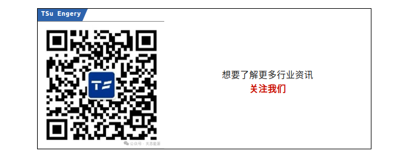

**天苏十条 | 2024.5.19-5.26 第十七期**

> 《天苏十条》第17期详记了全球对清洁能源的迫切需求。Tesla在上海开设储能超级工厂，继续巩固其在全球储能市场的领先地位，也表明中国在新能源产业链中的重要性日益凸显。北京航空航天大学的氢能航空发动机首飞，标志着氢能在航空领域应用发展的新里程碑。Amazon的光伏储能AI项目、Genevos的氢燃料电池模块以及Nel与印度的技术合作，展现了全球企业在新能源技术上的积极探索与合作。
> 在市场与政策方面，我国推出绿电消费核算机制和锂电产业链的融合发展，反映了政策和市场对绿色能源的强力支持。国际上，澳大利亚发布的首个国家电池战略，则体现了各国在新能源领域的竞争与合作，这将加速全球能源结构的转型。
> 这些发展推动了全球新能源产业的技术进步和市场扩展，并彰显了各国在应对气候变化和推动可持续发展方面的共同努力。新能源技术的不断突破和应用，将为实现全球碳中和目标提供有力保障，并带来广袤的经济和社会效益。

## **一、上海储能超级工厂开工**

特斯拉在上海的储能超级工厂已于2024年5月23日正式开工。这是**特斯拉**在美国本土之外的**第一座储能超级工厂**，位于上海临港新片区。该工厂预计将于**2025年**第一季度投产，年产能将达到1万台超大型电化学商用储能系统Megapack，储能规模接近40吉瓦时。

特斯拉储能超级工厂的开工标志着特斯拉在战略上对储能业务的重视。特斯拉的储能产品已遍布全球65个国家和地区，其储能业务毛利同比**增长140%**，显示出储能业务的增长速度可能快于电动车业务。特斯拉首席执行官埃隆·马斯克曾表示，可再生能源的未来有赖于大规模储能，而特斯拉Megapack储能系统能够支持千兆瓦时规模的**低成本、高密度**公用事业及商业项目用电，具有很高的**灵活性**。

## **二、首个直吹冷却氢能发动机亮相**

由北京航空航天大学研制的“北航氢动一号”全电航空发动机日前完成首飞，是**国内首次**将推进器、电机、燃料电池等经过融合设计而成的氢能航空发动机，该发动机由氢燃料电池供能，零碳节能环保，最大续航时间比采用同质量锂电池**提升了一倍**。

目前多数中小型无人机都选用锂电池作为储能装置，不足之处是锂电池能量密度较低，难以维持无人机的长时间留空飞行。相比于同质量的锂电池，**氢燃料电池能量密度更高，可提升中小型无人机的续航时间。**本次“北航氢动一号”搭载的试飞无人机为一款翼展3.5米的复合翼无人机，机身前端安装的就是直吹冷却氢能发动机。下一步，将针对下一代氢能混合动力航空发动机开展原理构型探索等基础研究和关键技术攻关，拓展**氢能航空动力**在未来航空领域的应用。

## **三、新绿电消费核算机制被推出**

5月13～19日在北京市举办的“电”亮零碳未来活动中，首都电力交易中心有限公司推出了**绿电消费核算机制**。

这一机制可记录用电主体以**绿电交易、绿证交易、自发自用可再生能源电力**等方式消费的绿电和获取的环境权益，形成用电主体绿电消费清单，帮助用电主体掌握自身的绿电消费水平，为政府部门制定相关政策提供支撑，激发全社会绿电消费活力。绿电消费核算机制的推出为绿电消费政策落实提供了有力抓手。各类用电主体可自愿在首都电力交易中心申请设立绿电消费核算账户，也可设立相关联的集团账户、子账户。

## **四、锂电产业链融合发展成新趋势**

作为电动汽车的“心脏”，**动力电池**在整车安全性、续航里程、成本、使用年限等表现上直接决定了车辆的安全和品质。因此，整车制造之外，汽车企业在**电芯产品应用、系统集成、电池产能、极限制造、电池研发**等方面纷纷加大马力，呈现出电池发展新趋势。

日前，北京时代动力电池有限公司(以下简称“时代动力”)在北京亦庄注册成立。《证券日报》记者查询天眼查显示，该合资公司注册资本**10亿元，**其中北汽海蓝芯能源科技出资**39000万元**，占比39%，是管理与投资主体；宁德时代出资**51000万元**，占比51%；京能科技出资5000万元，占比5%；小米汽车出资**5000万元**，占比5%。

## **五、绿电交易新增内蒙试点市场**

日前，《内蒙古电力市场绿色电力交易试点方案》获**国家发展改革委和国家能源局**批复，蒙西电网成为继国家电网、南方电网后国家批复的**第三个绿电交易试点**。绿色电力交易一方面将可再生能源发电企业与需求侧用户直接连接起来，有利于可再生能源利用规模的扩大；另一方面可帮助企业获得相应的绿色权益，提高其ESG(环境、社会和公司治理)表现和“出海”竞争力。

我国绿电交易市场潜力巨大，普遍认为，随着交易试点的进一步扩大，我国绿电将迎来更大发展空间。根据国家能源局发布的**《绿色电力交易专章(征求意见稿)》**，绿色电力交易是以绿色电力和对应绿色电力环境价值为标的物的电力交易品种，交易电力同时提供国家核发的可再生能源绿色电力证书(以下简称“绿证”)，以更好体现绿色电力的环境价值。

## **六、亚马逊完成首个光伏储能AI项目**

亚马逊近期完成了其**首个光伏储能人工智能项目**，该项目位于南加州莫哈韦沙漠的Baldy Mesa太阳能储能电站。在这个项目中，亚马逊使用**机器学习(ML)模型**来预测电池何时充电和放电，以及如何将能量回馈到电网中。这一技术的应用旨在优化电网解决方案，以实现更高效地购买、存储和销售电力。

亚马逊全球可持续发展副总裁卡拉·赫斯特强调了人工智能(AI)在推动社会向无碳能源过渡和大规模应对气候变化方面的重要性。她指出，将**亚马逊支持的太阳能项目与AWS支持的人工智能技术相结合，**有助于确保电网及其服务的客户每天获得更长时间的稳定无碳能源供应，同时也有助于亚马逊朝着成为一家更可持续的公司迈进。

此外，亚马逊还在圣贝纳迪诺航空枢纽开发了一个**人工智能模型**，该模型结合了机器学习功能和亚马逊屋顶太阳能电池阵列的性能数据，旨在帮助Air Hub和其他设施最大限度地减少能源消耗。这一模型一旦启动，预计能够提供对站点性能和电力产生的预测洞察，这是一项人类难以完成的任务，因为它需要分析和监控每个系统和建筑 。

## **七、Genevos推出氢燃料电池模块**

Genevos 最近推出了一种新型的**250KW海事氢燃料电池模块**，名为 HPM-250。这个模块是为了满足沿海和近海船舶日益增长的**零排放**需求而设计的，并有望在**2025年**获得型式认证。法国必维船级社(Bureau Veritas)已经向Genevos颁发了该模块的原则上批准(AiP)。

Genevos 是海事领域氢燃料电池动力系统集成和认证的领导者。其新推出的 HPM-250 模块是一种大功率解决方案，旨在**应对绿色氢的可用性**、排放法规的进步以及减少水下噪音以保护海洋生物的环境压力。这种模块化的解决方案具有高可扩展性和冗余性，同时无振动运行，减少了维护要求，符合**零排放法规**。

此外，Genevos 还推出了 HPM-80 燃料电池，这种80kW的即插即用船用燃料电池可以堆叠至多兆瓦规模，为渡轮和服务船等能源密集型应用提供零排放解决方案。这些燃料电池为推进系统从**10 kW**到**5 MW**的船只和船舶提供**脱碳解决方案**，正处于型式批准认证过程中。

## **八、Nel独家授权印度企业专利使用权**

Nel Hydrogen Electrolyser AS，作为Nel ASA的全资子公司，已经与印度信实工业有限公司(Reliance Industries Limited, RIL)签署了一项技术许可协议。根据这项协议，RIL获得了在印度独家使用**Nel碱性电解槽的权利**，并允许在全球范围内生产Nel的碱性电解槽。这一合作被视为Nel历史上的重要里程碑，因为它不仅支持信实实现其全球抱负，还使Nel能够从快速增长的市场中获得收入来源。

此外，印度政府最近公布了**首次绿氢和电解槽项目**的竞标结果，其中信实工业是两个招标项目的大赢家。这些项目是印度在绿氢和电解槽生产方面的重要步骤，目标是到**2030年每年生产500万吨绿氢，并使绿氢的生产成本在2025年达到与灰氢相当的水平。**

## **九、钒液流电池获得新的A轮融资**

新加坡的**钒液流电池**制造商VFlowTech近期完成了**新的A轮融资**，这次融资被视为公司发展的重要里程碑，并标志着其进军**混合长时储能市场**的重要一步。VFlowTech的技术核心在于其创新的钒氧化还原液流电池(VRF电池)，与**传统储能系统相比，液流电池具有多种独特优势**，如能量与功率容量可独立设计、循环寿命长、维护成本低等，这使得VFlowTech的储能系统在可再生能源整合、电网调节、应急备电等领域有着广泛的应用前景。

本轮融资由全球港口运营商PSA International旗下的创新与企业风险投资部门PSA Unboxed领投，体现了对VFlowTech技术创新与商业模式的高度认可。新资金的注入将为VFlowTech带来新的发展机遇，使其能够**扩展混合能源存储解决方案**、扩大制造能力并增加研发活动，以支持日益增长的市场需求。VFlowTech计划将这笔资金用于增强内部生产能力，特别是**全氟聚合物离子交换膜的研发**，这将提高公司产品的性能，降低生产成本，进一步减少其“Power Cube”电池系统的总成本，提升产品在市场上的竞争力。

## **十、澳大利亚发布电池发展战略**

澳大利亚政府于2024年5月23日发布了**首份国家电池战略**，旨在推动电池行业发展，增强澳大利亚经济的韧性。该战略由澳大利亚总理阿尔巴尼斯和工业与科学部长胡西奇共同发布。根据战略内容，澳大利亚将重点建立**能源存储系统**、向全球市场提供**加工后的电池组件**、打造更**安全可靠的连接电网电池**，并为澳大利亚运输制造业提供电池。

为了支持这一战略，澳大利亚政府在**2024年7月至2025年6月**的下一财年预算案中，计划投资**5.232亿**澳元用于“电池突破倡议”，以促进电池制造业的发展。此外，还将投资**2030万**澳元用于激励尖端电池研究，以及投资**17亿**澳元于“未来澳大利亚制造”创新基金，支持电池等清洁能源制造业。

阿尔巴尼斯表示，澳大利亚必须成为全球电池领域的参与者，电池是澳大利亚清洁能源组合的关键部分，这将有助于澳大利亚实现减排目标并打造强大的清洁能源制造业。澳大利亚希望借此战略在新能源领域发展成一个可再生能源超级大国，而不仅限于矿产挖掘和运输。**为实现这一目标，澳大利亚计划在未来两年内提供约22.7亿澳元的财政激励。**

---

