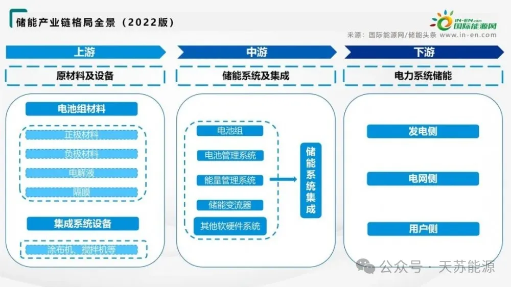
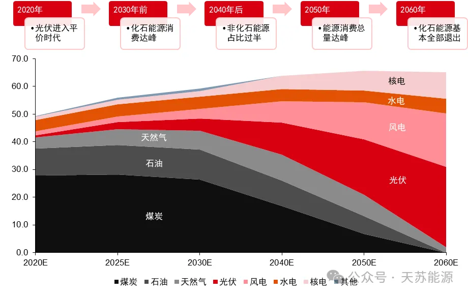
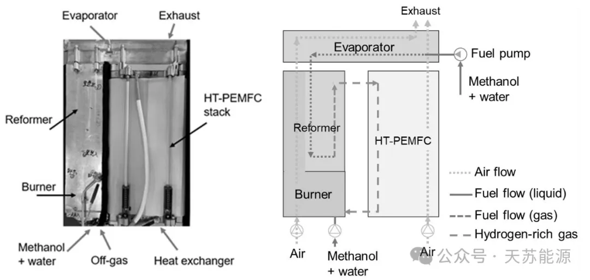
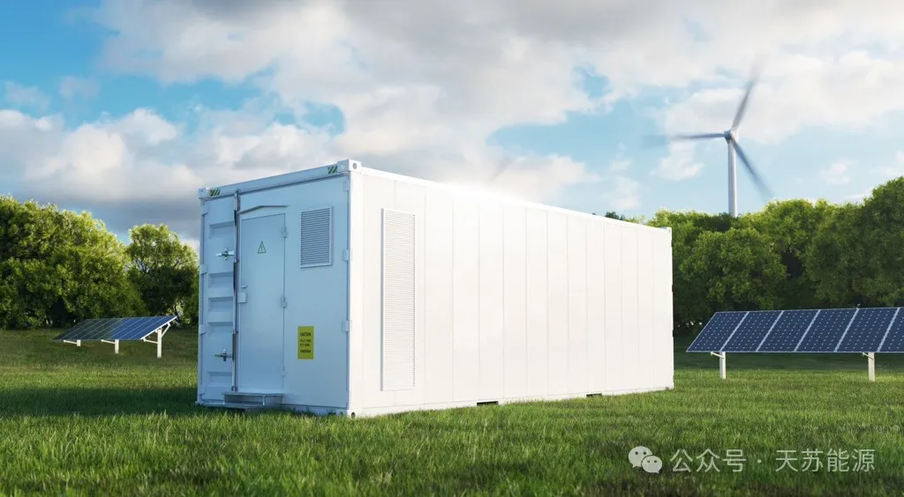
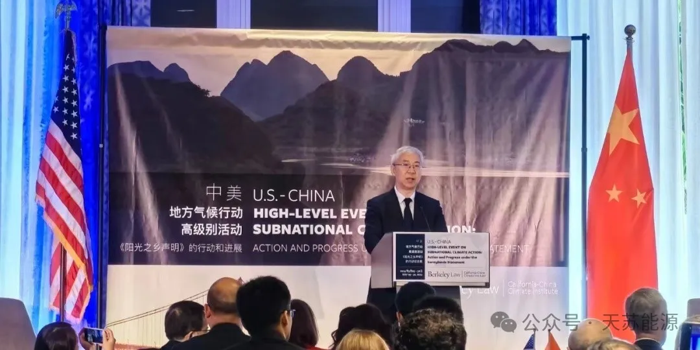
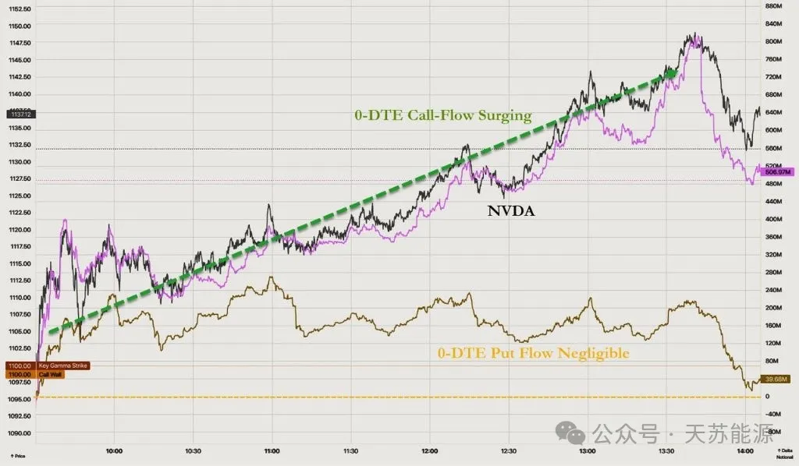
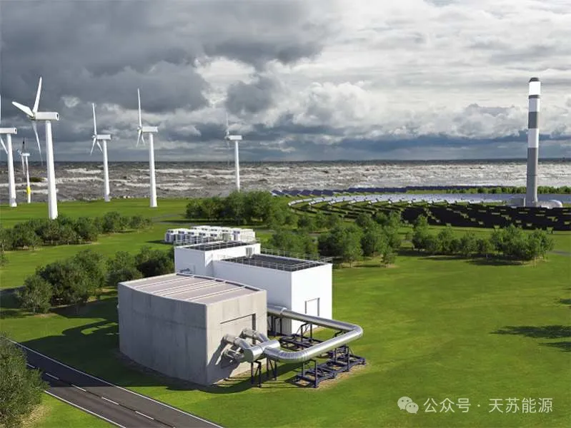
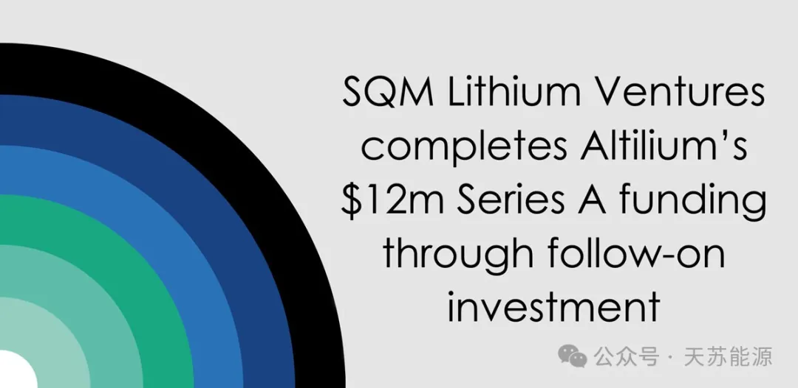

**天苏十条 | 2024.5.26-6.2 第十八期**

> *《天苏十条》第18期详细记录了储能发展的全球格局演变。全球储能产业蓬勃发展，中石化发布的能源展望标志着中国在推动全球碳中和方面的坚定承诺正逐步实现，产业发展的政策基础得到切实落实。中美作为全球超级大国在气候行动上的高级别会晤，为碳中和的全球性发展奠定了坚实的历史基础。*
> *令人欣喜的是，中国作为全球超级大国，正愈加展现其全球领袖的风范，在全球能源转型和可持续发展中发挥重要作用。*
> *在深度技术研发领域，嘉鸿燃料电池获得了船级社认证，而比克电池的电芯技术则引领了锂电池行业的精细化发展趋势。在全球能源过剩的背景下，储能市场格局逐渐清晰，各地不断出现的负电价现象也将加速储能产业的快速发展。电网侧调度成为行业发展的核心决策点，如何将储能与光伏、火电、风电等板块联动起来，形成动态网络以提高整体配电送电效率，将成为未来行业竞争的关键。*
> *全球储能产业正在快速发展，中国和美国在这一领域的政策和技术进步为全球碳中和目标的实现奠定了坚实基础。未来，随着技术的不断突破和政策的进一步完善，储能产业将迎来更加广阔的发展前景，并在全球能源结构转型中发挥关键作用。*

## **一、储能电池新增产能超130GWh**

2024年5月，储能市场明显升温，**18家**企业规划新增储能电池产能超过**130GWh**。这些项目包括了拟建、签约、开工及投产等不同阶段。然而，需要注意的是，储能产业的高热度曾催生出大量的“名义产能”，其中相当一部分仅为签约产能，而非实际开工产能。例如，黑芝麻公司**35亿元**储能电池项目和华软科技锂电池电解液项目近期宣布暂缓或取消。

**市场需求方面，今年“新型储能”首次被写入政府工作报告，其发展被认为将按下“加速键”。**国能信控还发布了**1.08GWh**储能系统招标，国电投新源智储发布1GW的储能PCS框采，中国石油和中国电气装备也发布了储能相关集中采购供应商资质核查公告。这些央企的年度储能集中采购计划进一步刺激了储能市场的高景气度。

## **二、中石化发布能源展望报告**

中国石化在沙特利雅得发布面向2060年的能源展望，**预计中国将在2030年前实现碳排放峰值，2060年实现碳中和。**煤炭、石油、天然气消费将分别在2025年、2027年、2040年达峰值，非化石能源将成主体。

从氢能产业及能源化工趋势来看，中国氢能产业预计到2060年消费规模近**8600万吨**，产业规模达**4.6万亿元**。非化石能源制氢比重将增至**93%**，以风能和太阳能为主。2024年能源化工产业需加强资源节约与循环利用，积极应对国际油价高位运行，化工新材料将加快发展。

## **三、嘉鸿燃料电池获船级社认证**

中科嘉鸿(佛山市)新能源科技有限公司自主研发的高温质子交换膜燃料电池模块在2024年5月23日获得了中国船级社(CCS)的认证。这一认证标志着该产品在电动船应用领域取得了突破性进展，**是国内首款通过CCS认证的以高温质子交换膜为核心技术的燃料电池模块产品。**

中科嘉鸿的这一成就不仅展现了其在新能源船舶领域的技术实力，而且对于**推动航运业向绿色低碳高质量发展转型具有重要意义**。多套电池模块可以通过串联/并联的方式为船舶主动力或辅动力电源提供能量来源，适用于清洁船、渔业辅助船、观光游船、巡逻船、游艇、内河货船等多种国内航行船舶。

## **四、共享式储能电站建成**

电投能源与华润新能源合作共建的共享式储能电站项目位于内蒙古阿巴嘎旗，该项目规划总容量为150MW/300MWh。合资公司中，锡盟新能源公司控股**51%**，华润公司参股**49%**。**锡盟新能源公司以持有的阿巴嘎旗电投新能源有限公司100%股权作价出资，华润公司则以现金方式出资。**项目场址位于锡盟阿巴嘎旗别力古台镇东南方向，地势平坦开阔，紧邻G303国道，交通便利，能满足重大件运输要求。

共享式储能电站的建设将有助于**提升电网的调节能力**，优化能源结构，并支持新能源项目的接入和运行，对于推动地区能源转型和实现可持续发展具有重要意义。

## **五、比克电池动力“芯”时代启幕**

比克电池(BYD)在eVTOL(电动垂直起降)领域提出了**“三高一快一长”**的技术理念，旨在为电动航空领域提供高效、安全、可靠的动力解决方案。

比克电池强调**电池的安全性，电池具有高能量密度，电池设计具有长寿命，**可以承受多次充放电循环，减少维护成本，延长飞行器的使用周期。**比克电池支持快速充电技术，**可以在短时间内为电池充满电，提高飞行器的运营效率。结合高能量密度和快速充电技术，比克电池能够提供更长的续航能力，满足eVTOL飞行器的飞行需求。

## **六、中美气候行动高级别活动**

为落实中美元首旧金山会晤共识，根据中美**《关于加强合作应对气候危机的阳光之乡声明》**，中美地方气候行动高级别活动于5月29日在美国加州伯克利召开。

**中美省州、城市间的气候合作拥有坚实基础，期待各方深入开展交流、推动务实合作。**会上发布中国国家发展改革委与美国能源部碳捕集利用与封存项目合作工作计划、与美国加州合作谅解备忘录重点合作事项，生态环境部对外合作与交流中心与美国加州—中国气候研究院“遇见美丽：中美青少年未来气候领袖研修交流项目”，中国广东、海南与美国加州有关合作文件等成果。

## **七、ERCOT储能辅助服务市场饱和**

ERCOT(电力可靠性委员会运营区)的日前市场数据显示，高峰期间的能量价格与辅助服务(如向上调频和响应备用)的**出清价格存在显著差异**。在下午5点至7点，能量价格平均为**798美元/兆瓦时**，而响应备用价格仅为**7美元/兆瓦时**。晚上7点至8点的高峰时段，能量价格飙升至**2,221美元/兆瓦时**，但响应备用和向上调频价格平均为**998美元/兆瓦时**。

事实上，**ECRS服务尚未饱和，但电池参与度低。ERCOT的应急备用服务(ECRS)出清价格与日前能量价格相当接近，显示该服务尚未饱和。**但与Modo Energy的观察一致，ECRS中电池的参与率远低于向上调频和响应备用服务。这主要是因为ECRS服务要求电池能连续两小时履行服务职责，限制了其参与度。

## **八、能源过剩致电价负值**

据瑞典银行SEB研究所的报告，在过去十天里，太阳能生产商在发电高峰时段不得不接受高达**87%**的折价，电价甚至跌至零以下。平均而言，太阳能生产商输出每兆瓦时电力只能产生**9.1欧元**的收入，远低于非太阳能发电时段的**70.6欧元**。SEB首席商品分析师Bjarne Schieldrop指出，到2023年底，德国太阳能总容量超过了**81.7吉瓦**，而需求负荷仅为**52.2吉瓦**。

对于整个市场而言，负电价即无法让广大普通消费者获益，又会对电网造成冲击，同时也会阻碍新能源的发展。**对于光伏或风电厂而言，最大的问题在于灵活性不足，也就是可再生能源发电时间与居民用电时间的不匹配。**储能将是解决风电和光伏电力难以保存问题的有效手段之一，它有助于提高电力系统的灵活性和可靠性，促进可再生能源的更广泛应用。

## **九、全球最大锂电储能站起火**

当地时间5月15日下午，美国加利福尼亚州的盖特韦(Gateway)储能电站首次被发现起火。该电站装机达**250兆瓦**。5月16日下午，大火几乎被扑灭，但此后该电站电池又重新复燃。5月18日，《圣地亚哥联合论坛报》称，**燃烧了近四天后，没有迹象表明将全面遏制**。

该电站采用了LG Chem的电芯，为三元锂电池。三元锂电池和磷酸铁锂为当前锂电池两大主流路线。**三元锂电池有着更高的能量密度，但也极易发生电池热失控等风险。**公开披露的储能电站火灾事故中，三元锂电池占比较高。

## **十、SQM一季度亏损63亿**

因锂产品售价暴跌超七成，**全球第二大锂生产商智利化学矿业公司 (下称SQM)一季度巨亏。**

5月23日，SQM公布最新财报称，今年前三个月净亏损约**8.7亿美元**(约合63亿元人民币)，**原因是电动汽车动力电池所需的金属锂供应过剩，拖累了产品价格同比下滑**。今年一季度，该公司每股亏损**3.04美元**。SQM同期的营收下降了一半以上，至**10.9亿美元**(约合79亿元人民币)，同样低于分析师预测的**11.3亿美元**(约合81.8亿元人民币)。

---

