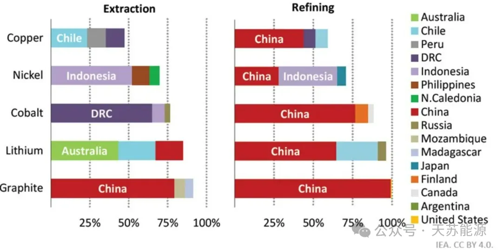
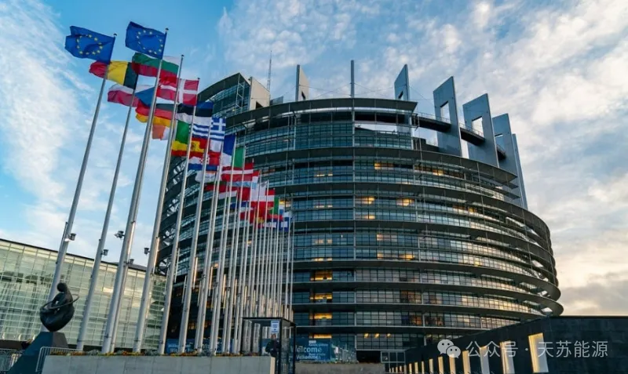
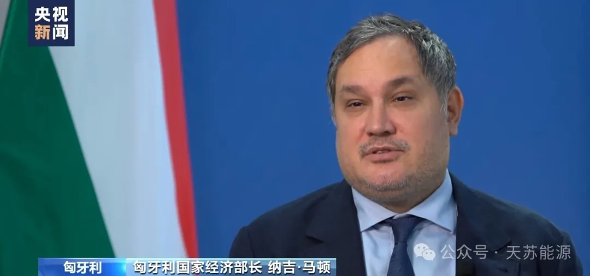
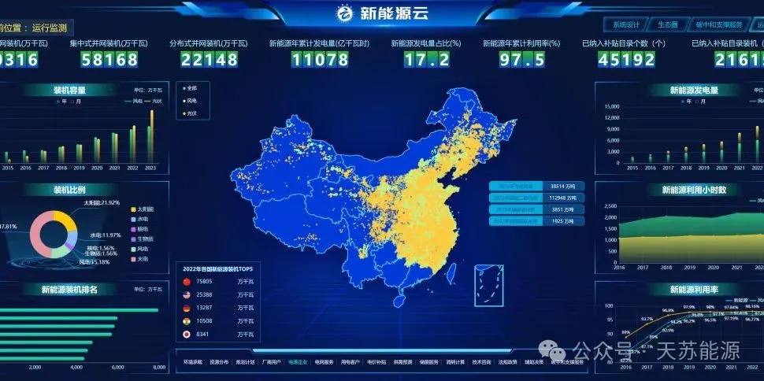
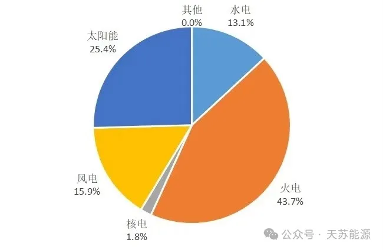
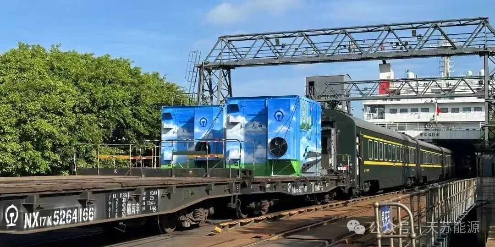
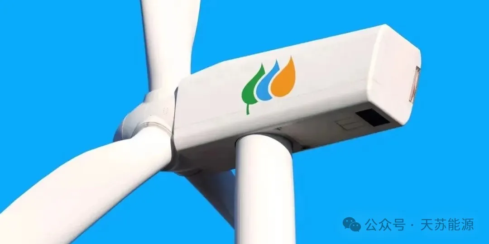
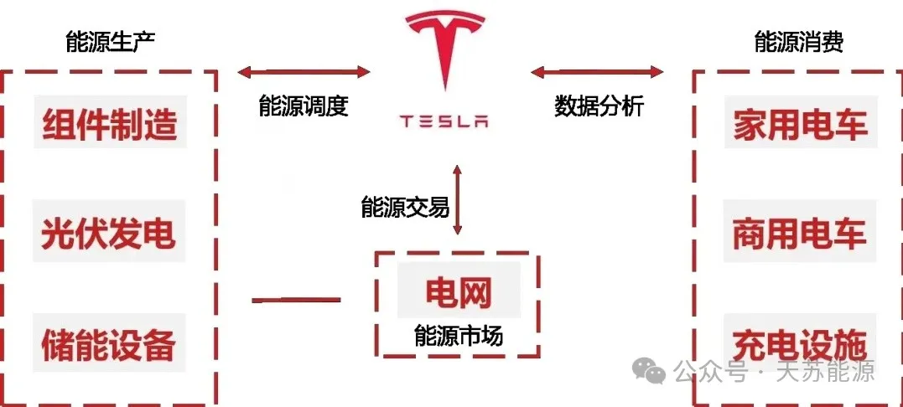
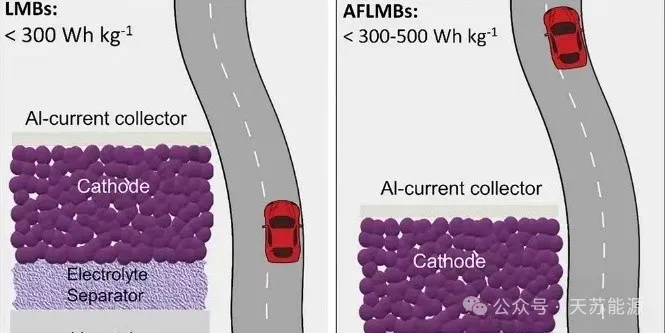

**2024 | 天苏十条 • 二十三期 | 07.08-07.14**

### ***天苏评***

> *欧盟对中国电动汽车加征关税的主要原因在于保护本土产业，防止中国企业凭借其低成本优势（低廉的劳动力成本与集中的制造产业链优势）主导欧洲市场。这一措施表面上体现了经济保护主义，但实际上反映了当前全球能源技术竞争格局的演变。中国在可再生能源领域，尤其是电池技术和能源生产方面，已具备全球市场的显著影响力。欧盟通过设置关税壁垒，试图减缓这一趋势，以保护和促进本土新能源产业的发展。然而，这种措施只能对欧洲内部市场起到短期的预防作用，无法从根本上遏制中国可再生能源行业的快速扩张。*
> *当前，各主要经济体的能源研发方向主要集中在以下几个方面：电动汽车的普及、可再生能源的发展、能源互联网的应用及氢能的投入。这些方向分别涵盖了能源的生产、转化、利用、分配与管理。任何一个领域的突破，都会加速能源市场格局的变化，推动能源行业向更加高效、经济和可持续的方向发展。*
> *从企业角度来看，增加研发投入、扩展全球品牌布局、强化销售渠道和资金支持，并积极参与制定行业标准，是一个企业完整生命周期的关键要素。在全球能源格局下，精细化的管理与优化至关重要。企业需要将精力聚焦于关键领域，长期坚持，逐步实现示范项目的突破与扩展复制。*
> *全球的能源人才聚焦于一个个关键技术点，推动行业发展。各种组织通过集聚人才和资源，推动整合和前进，最终实现能源领域的可持续发展。通过细致的规划和持续的努力，能源行业才能生生不息，繁荣昌盛。*

## **市场政策**

### **一、IEA发布《电池与能源安全转型》**

国际能源署报告指出，**电池技术是实现清洁能源转型和保护能源安全的核心**。随着电动汽车市场的快速增长，尤其是轻型乘用车领域，动力电池应用显著提升。此外，电池储能系统对电力系统的稳定性和可再生能源的高效利用起到关键作用，预计2030年前全球电池存储市场将大幅增长。
  

另外，全球动力电池产业链高度集中，中国在全球电池市场中占据主导地位，从原材料供应到电池制造均占据重要份额。尽管存在供应链风险，但电池技术的不断进步和成本降低将推动其持续快速发展。报告预测，到2030年，**动力电池市场将突破3TWh，高镍电池有望成为主流技术**，电池产业链在面临挑战的同时也将迎来巨大机遇。

### **二、AI赋能，美国能源前沿研究**

美国能源部发布的《能源领域AI前沿研究方向》报告指出，**AI在核电、电网、碳管理、能源储存和能源材料等五大关键领域具有关键作用**，能高效处理复杂系统特征，推动清洁能源与材料科学的突破。报告强调，AI将加速能源材料的发现与设计，提高实验室自动化水平，缩短从研究到工业应用的周期，**对实现2050年可持续性与清洁能源目标至关重要**。特别在能源生成、存储与效率提升，以及环境可持续性与可伸缩性方面，AI将助力开发高效、环保的新材料，减少对非再生资源的依赖，并应对气候变化挑战。

### **三、欧洲呼吁储能应对能源挑战**

欧洲储能协会在欧盟选举前夕强调储能系统在应对能源挑战中的关键作用，**指出其不仅能增强能源安全、降低费用，还推动脱碳进程**。随着欧盟寻求2030年脱碳及2050年净零目标，**储能被视为核心**。然而，尽管已有相关计划和改革，储能部署仍面临障碍，需加快监管改革、制定统一战略、确保政策一致性，并更新电网费用结构，以充分发挥储能潜力。
  

欧洲储能协会提出的六点计划**旨在消除储能部署障碍，确保长期投资确定性**。这包括改革监管、制定欧盟储能战略、协调供暖和制冷政策、明确脱碳目标、开发电力弹性市场及优化电网费用结构，旨在通过综合性措施推动储能行业快速发展，助力欧盟实现能源转型和气候目标。

### **四、匈牙利反对征中国电动汽车关税**

据央视新闻报道，当地时间7月10日，匈牙利国家经济部长纳吉·马顿在布达佩斯举行新闻发布会宣布，匈牙利向欧盟竞争力委员会提交了一份提案，以加快欧盟向电动汽车转型。对于向中国电动汽车征收临时反补贴关税，**匈牙利政府不支持欧盟的保护主义和市场限制措施**，这一举措意味着会导致贸易战，不会对任何一方有好处。

## **系统优化**

### **五、国网建全球最大新能云平台**

11日从国家电网公司服务新能源高质量发展新闻发布会获悉，当前，我国能源结构调整加速推进，风光新能源装机已突破**11亿千瓦**。国家电网发挥电网平台功能，全力做好并网服务，**建成全球规模最大的新能源云平台**。

新能源云平台将新一代信息技术与新能源全价值链、全产业链、全生态圈业务深度融合，聚集全数据要素。目前，平台已接入新能源场站超**600万座**，服务各类企业**1.6万余家**。

### **六、中国电能总能耗**占比**有望达35%**

中国电力企业联合会发布的《中国电力行业年度发展报告2024》预测，**2024年全国电力供需将总体紧平衡，新能源装机快速增长提升供应能力**，但受新能源发电及来水不确定性影响，**供需平衡仍存风险**。报告还展望至2030年，预计我国电力需求持续增长，非化石能源发电装机占比将接近**70%**，电能占终端能源消费比重有望达到**35%**，彰显我国能源结构转型和电气化进程加速的趋势。

  

《报告》指出，未来我国电力供需形势面临挑战与机遇并存。2024年电力供应虽因新能源装机增加而提升，但受自然因素影响存在不确定性，总体维持紧平衡。展望至2030年，**电力需求刚性增长，非化石能源发电占比显著提升**，推动能源供给体系清洁化、低碳化。同时，电能占终端能源消费比重预期增长，反映出我国加速推进可再生能源消费替代和终端能源消费电气化的坚定步伐。

### **七、首批移动储能电站使用**

7月11日，全国首批移动储能电站在海南铁路跨海列车上启用，**解决了列车渡轮停电时车厢高温问题**，提升旅客舒适度。这些储能电站如“大型充电宝”，确保列车在无传统电源供电时仍能维持空调运行，将车厢温度从最高**40℃**降至**26℃**左右。首批**6台**电站已部署于琼州海峡两岸，初期服务于出岛过海及白天进岛列车，未来计划推广至更多列车。

## **组件创新**

### **八、伊维尔德罗拉优化电网AI项目**

西班牙伊维尔德罗拉公司（Iberdrola）与BCAM合作，在GSGIH框架下开发创新数据空间（i-DS）项目，**利用AI优化电网数据价值提取，提升配电网络服务**。BCAM参与预测低压电网需求，助力电网规划和投资。双方已有合作基础，共同推进IA4TES项目研究AI在电力行业的应用。Iberdrola通过GSGIH保持能源转型前沿地位，与众多技术伙伴合作，投资超亿欧元于智能电网创新项目。

BCAM作为跨学科研究中心，致力于通过知识转移服务社会，与Iberdrola再次携手，在GSGIH框架下深化合作。此次合作聚焦于i-DS项目，旨在通过AI技术提升电网数据利用率，优化配电网络运营。**Iberdrola借此机会保持在能源转型领域的领先地位，并推动智能电网的创新与发展。**

### **九、特斯拉户用储能新方向**

特斯拉近期与SPAN及Octopus Energy达成战略合作，**共同推动户用储能市场**。与SPAN合作推出智能户储套装，结合高效能源管理与实时监控，为用户提供更经济的储能方案。同时，特斯拉与Octopus Energy合作，将Powerwall引入英国与西班牙，利用智能电价机制为客户节省成本，并优化电网平衡。特斯拉的储能业务持续增长，特别是Megapack的部署，上海储能超级工厂的开工将进一步扩大产能。特斯拉已在全球部署超**60万个**Powerwall，并试行虚拟电厂计划，致力于构建完善的户储生态，解决家庭用能的经济性与稳定性问题。

### **十、锂金属电池：能效倍增，环保减半**

苏黎世联邦理工学院研究团队开发出新型锂金属电池技术，**通过大幅减少氟含量，解决了电池稳定性与环境影响问题**。该技术不仅提高了电池的稳定性和环保性，还降低了成本，有望实现电动汽车续航翻倍和智能手机充电次数减少。新方法利用静电吸引，使液态电解质中氟含量降至**0.1%**，为现有电池生产流程提供无缝集成方案。

研究团队计划进一步测试该技术的可扩展性，**并尝试将其应用于智能手机电池中**。该技术有望在未来推动电池技术的革新，为电动汽车和智能设备提供更高效、更环保的能源解决方案。

---

