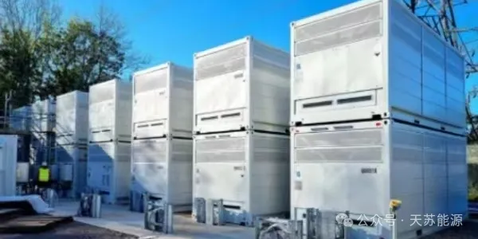

**2024 | 天苏十条 • 二十四期 | 07.15-07.21**

### ***天苏评***

> *随着全球能源结构的转型，氢能与可再生能源的发展日益受到重视。澳大利亚CEC发布的长时储能报告，为全球储能市场提供了确定的参照标准，也凸显了储能技术在能源转型中的作用。与此同时，新能源电池循环利用信息平台的上线，标志着资源循环利用意识的提升，这对于减少环境污染、推动可持续发展具有重要意义。*
> *在氢能源领域，氢能源车入驻法国奥运会虽然引起了争议，但这也反映出氢能源作为清洁能源的代表，正逐渐在大型活动中崭露头角。而成都在推动氢燃料电池商用车指南的发布，则为氢能产业的发展提供了政策支持和市场引导。*
> *然而，市场动态并非一帆风顺。McPhy出售氢燃料业务的事件提醒我们，氢能产业的发展仍面临诸多挑战。与此同时，氢动力飞行在航空市场占据四成份额，显示出氢能技术在航空领域的巨大潜力，但成本和续航问题仍是其普及的难题。*
> *在光伏领域，天合光能系列组件在测试中位列榜首，这不仅是对企业技术创新的肯定，也展示了我国光伏产业的国际竞争力。此外，全绿电供应虚拟电厂的投运，进一步优化了绿色电力供应体系，提高了电网的灵活性和可靠性。*
> *技术创新方面，氢燃料专用超充电池的亮相，为氢燃料电池汽车的普及提供了有力支持。而3M投资电解槽材料开发，则有望推动制氢成本的降低，助力氢能产业的可持续发展。*
> *总之，氢能与可再生能源领域的发展态势表明，我们正处在一个能源变革的时代。面对技术创新、市场动态和政策支持带来的机遇，我们应积极应对成本、安全性、兼容性等挑战，推动氢能与可再生能源产业的健康发展，为实现全球能源转型贡献力量。*

## **市场政策**

### **一、澳大利亚CEC发布长时储能报告**

**澳大利亚清洁能源委员会**(CEC)最近发布了一份关于长时储能未来发展的研究报告。该报告深入探讨了**长时储能**技术在澳大利亚能源结构转型中的关键角色，以及这些技术在提高澳大利亚能源系统的安全性和可靠性方面的重要贡献。

  

报告重点关注的领域包括**绝热压缩空气储能系统和氧化还原液流电池储能系统**等长时储能技术。这些技术因其大容量和长时间持续的特点，成为应对电力供需波动的重要选择。特别是，绝热压缩空气储能系统以其显著的**大容量和长持续时间特点**，在电力系统中发挥着重要作用。而氧化还原液流电池储能系统则因其高效环保的特性，在可再生能源并网和电力调峰方面显示出巨大的应用潜力。报告还提到了其他一些长时储能技术，如钠离子电池储能系统、金属-空气电池储能系统、重力储能系统、液体空气储能系统(LAES)以及氢气储能系统等。这些技术各具特色，预计将在未来的电力系统中扮演重要角色。

### **二、新能源电池循环利用信息平台上线**

近日，中国科学院过程工程研究所环境技术与工程研究部、中国科学院化学化工科学数据中心等共同开发的**新能源电池循环利用信息平台** (www.nebcycling.cn) 正式上线。该平台是国内首个覆盖新能源电池领域循环利用原料、产品、工艺、安全、价格、行业动态、政策标准、科研进展等全产业链信息平台，可**为实现新能源电池安全高效回收利用提供数据支撑。**
  

平台数据主要来源于工业和信息化部、国家发展和改革委员会、生态环境部、公安部、全国标准信息公共服务平台等官网公布的数据，行业白皮书、蓝皮书和协会联盟组织等发布的年度报告数据，以及平台开发团队在该领域多年积累的相关数据。该平台包括**电池回收、行业企业、政策文献和价格动态**四大模块。目前，该平台处于试运行阶段。

### **三、氢能车入驻法国奥运会惹争议**

2024年**巴黎奥运会**选择丰田Mirai氢能车作为官方用车，引发了争议。**120位**科学家、工程师和学者联名撰写了一封公开信，呼吁巴黎奥运会组织者放弃使用**丰田Mirai汽车**。他们认为，尽管氢动力汽车的尾气为零碳排放，但全球**96%**的氢仍然来自甲烷等化石燃料，这使得**大多数氢动力汽车的污染程度远远超过电池电动汽车**，只比传统的内燃机汽车稍微清洁一些。这些专家指出，丰田公司推广氢动力汽车与“净零排放”的目标相悖，可能会损害**2024年**奥运会的声誉。他们敦促奥运会组织者要求丰田公司用电池电动汽车取代Mirai作为奥运会的官方用车。

  

另一方面，丰田公司表示，他们提供的Mirai汽车使用的氢气是**从水和有机物中提取的**。丰田认为，通过使用包括燃料电池电动汽车在内的多种纯电动汽车和混合动力汽车，可以实现移动出行的碳中和。丰田Mirai车队将使用液化空气集团提供的**可再生能源氢气**进行补充。

### **四、成都推动氢燃料电池商用车指南**

成都市近期出台了《成都市推动氢燃料电池商用车产业发展及推广应用政策申报指南》，该指南由成都市经济和信息化局等**9个部门**联合发布。这一政策的目的是深入贯彻落实成都市关于**氢燃料电池商用车产业发展及推广应用**的相关行动方案，该方案覆盖了**2024至2026年**。

  

该指南旨在推动氢燃料电池商用车产业的发展。其中包括对**氢燃料电池商用车的推广应用、整车制造能力的提升、加氢站配套建设的加强**，以及**优化氢燃料电池商用车产业发展的环境**等方面。此外，政策还涉及到对符合条件的企业和项目提供奖励，最高奖励可达**5000万**元。这些措施预计将促进氢燃料电池商用车技术在成都市的快速发展，进一步推动该市乃至整个四川省在新能源汽车领域的进步。

## **系统优化**

### **五、McPhy出售氢燃料业务**

法国**电解槽制造商**McPhy近日宣布已完成将其**加氢站业务**出售给同行公司Atawey的交易。此次交易使得McPhy成为**一年内第二家**出售其加氢站权益以专注于电解槽制造的制造商。McPhy于**2023年12月**开始与Atawey进行独家谈判，最终以**1200万欧元(约1300万美元)**的价格成交。Atawey以**100万欧元**的价格收购了该业务，剩余的**1100万欧元**将在**18个月**内支付。

  

通过这次交易，**Atawey将把McPhy估计的****40座****加氢站(已安装或正在开发中)添加到其现有的70座加氢网络中。**此外，McPhy的加氢站设备制造设施——每年可以生产**80多座**加氢站——也使Atawey的生产能力翻了一番。作为交易的一部分，McPhy加氢业务的约**40名**员工也将加入Atawey。

### **六、氢动力飞行在航空市场占4成**

氢动力飞行在航空领域的应用前景非常广阔。到**2050年**，预计**氢动力飞机将占据航空市场的40%份额。**

欧盟的《氢动力航空》研究报告指出，氢能推进技术在航空脱碳方面具有显著的技术水平和发展潜力。氢动力飞行在**航空脱碳**中起着关键作用，特别是在短程和中程飞行中，氢能飞机有望成为领先的推进系统。然而，对于载客量超过**250人**、飞行距离超过**10000千米**的远程飞行，液态氢储罐的额外重量使得氢能成为不切实际的选择。因此，合成燃料可能更适合远程飞机。此外，全球氢动力飞机产业的发展将深刻影响航空供应链。氢动力飞机的设计和结构将与传统飞机不同，需要**更大的储氢罐空间，并对机场的基础设施和操作安全法规进行调整。**液态氢的储存和加注设施需要大量升级，以适应氢燃料的低温储存和易挥发特性。

### **七、天合光能系列组件位列测试榜首**

**天合光能**至尊**N型****720W**系列组件在最近由全球光伏行业权威媒体pv magazine进行的室内性能测试中表现卓越，获得了**综合指数第一**的成绩。

  

在室内测试方面，天合光能至尊**N型720W**系列组件**位列所有送测的TOPCon组件之首。**特别值得一提的是，在**弱光性能**和**温度系数**这两个影响组件单瓦发电性能的关键指标上，天合光能至尊N型组件的表现最为优秀。作为全球光伏行业的领军企业，它引领了多项关键技术的商业化，包括**选择性发射极、PERC、TOPCon、双玻、多主栅、高密度封装、矩形电池等。**此次测试中表现优异的至尊**N型720W**系列组件采用了**新一代N型i-TOPCon电池**技术，具有高转换效率、高双面率、低温度系数、低衰减等优良特性，进一步强化了高功率、高效率、高发电量、高可靠性及低度电成本的优势。

## **组件创新**

### **八、全绿电供应虚拟电厂正式投运**

**中国国内首个**全绿电供应虚拟电厂项目已于**7月18日**在浙江宁波东方电缆园区正式投入运行。这个项目由**中国广核集团**(简称中广核)打造，旨在**实现工业园区的全绿电供应。**项目包括**12.012兆瓦**的**分布式光伏**、**5兆瓦/11.2兆瓦时**的**储能系统**、**2台120千瓦****双枪直流分布式充电桩**和**10台14千瓦****双枪交流充电桩**。这些设施协同运行，能够满足园区**80%**的日常用电需求，剩余**20%**的电量缺口通过购买中广核浙江涂茨海上风电场的绿电来补充。

  

该项目的特色在于其多能源分布式资源集成管理模式，能够实现**全天24小时**可溯源绿电供应。中广核虚拟电厂示范平台还能监测和分析园区全天的用电量、发电量、储能电量及绿电供应占比，并依据实时电价等信息进行智能切换管理，从而提升项目的经济性。

### **九、氢燃料专用超充电池正式亮相**

这款氢燃料专用超充电池是**巨湾技研**针对氢燃料混动市场研发的突破性产品。它具有**稳定持续的高倍率充放电性能**，额定**4℃**充放电，峰值可达**8-10℃**充放电，这在全行业中处于领先地位。此外，这款电池还具备优秀的低温性能，即使在 **-20℃**的环境下也能实现**2C**放电。巨湾技研自研的BMS(电池管理系统)还能有效避免电池SOC(状态-of-电荷)测量不准确的问题。

  

这种超充电池与燃料电池系统的结合，为**长途、重载以及低温环境下的运输**提供了理想的解决方案。它不仅推动了**商用车电动化**的发展，也为实现中国的**碳排放**减少目标提供了坚实的技术支持。巨湾技研正致力于推动整个商用车行业朝着更加绿色环保的方向发展。

### **十、3M投资电解槽材料开发**

**3M**公司最近完成了对Ohmium International的战略投资，以**支持电解槽材料的开发**。Ohmium International是一家**专注于绿色制氢电解槽系统的开发商**。这次投资是3M致力于推动技术发展的一部分，旨在支持向低碳经济的转型，并可能帮助3M公司进一步探索其自身业务的脱碳。

  

Ohmium以其**质子交换膜(PEM)电解槽**的效率而闻名，这种电解槽优化了PEM与可再生能源结合生产绿色氢气的性能。绿色氢作为一种**非化石能源**，对于钢铁制造和化肥生产等难以减排的工业部门的脱碳至关重要。Ohmium的专有电力电子设备、超模块化设计和标准化制造方法，使其成为**绿色制氢领域**具有**成本竞争力、高效和高产出的领导者。**

---

