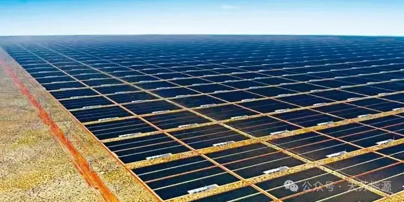

**2024 | 天苏十条 • 二十四期 | 07.15-07.21**

### ***天苏评***

> *全球经济自疫情后的复苏正在推动能源行业的稳定发展，电化学储能在其中扮演了重要角色。虽然电化学储能目前仅占全球储能市场的3.4%，但由于其建设迅速、灵活性高，能够有效平衡可再生能源带来的波动性问题，因此前景广阔。2018年被视为电化学储能的元年，全球装机规模达到6625MW，同比增长126.4%，市场占比从2017年的1.67%提升至3.70%。在中国，2018年电化学储能装机规模达到1072.7MW，同比增长175.2%，市场占比从2017年的1.35%增至3.43%。随着技术的进步，电化学储能的成本不断下降，容量和寿命不断提高，预计将迎来大规模应用，成为中国储能产业的主要发展趋势。*
> *根据CNESA的数据，2023年中国储能装机规模达到21.5GW/46.6GWh，同比增加192.6%和193.1%。截至2023年底，我国新型储能累计装机规模达34.5GW/74.5GWh。2024年上半年，储能并网规模为10.2GW/26.4GWh，同比增加13.1%和37.6%，平均配储时长达2.60小时，相较2023年的2.16小时显著提升。6月份，储能并网规模为5.4GW/11.8GWh，环比增长近三倍。*
> *储能市场的强劲需求推动了2024年的装机增长。根据储能与电力市场的数据，2022年完成招标的储能项目为44GWh，接近2023年的实际并网规模21.5GW/46.6GWh。2023年储能采购需求达48.2GW/118.5GWh，较2022年增长近三倍。2024年1-7月的招标规模已达30.46GW/82.16GWh，同比增幅超过90%，为全年装机提供了有力支撑。*
> *在美国市场，2024年6月储能新增装机规模为1.23GW/4.05GWh，同比增幅超过37%。2024年上半年，美国储能新增装机规模达到4.23GW/10.06GWh，同比增幅超过150%。随着淡季结束，自3月以来美国储能市场表现强劲，预计2024-2025年美国表前储能市场装机量将分别达到35.43GWh和52.02GWh，同比增长78%和46.8%。*
> *欧洲市场方面，德国在2024年1-7月的大储新增装机规模为231.59MWh，同比增长65.69%。英国上半年装机规模虽暂时因项目节奏影响有所下降，但全年装机增长预期仍然乐观，英国和意大利将成为欧洲大储增长的重要驱动力。*
> *总体来看，全球储能市场需求持续向好。然而，面对迅速扩展的储能需求，如何确保高效、安全、可持续的发展成为关键挑战。**天苏能源（tsuenergy.com）**正是专注于解决这一问题的行业领导者，通过创新的储能解决方案，天苏能源帮助全球客户优化储能系统的部署和管理，从而满足不断增长的市场需求，推动行业的可持续发展。*

## **市场政策**

### **一、华为发布电站数字化白皮书**

华为与雅砻江流域水电开发公司联合发布的《清洁能源大基地电站数字化技术白皮书》，通过**数字化、智能化技术**，系统性地解决了光伏电站从规划、建设到运维、运营的全生命周期挑战，特别是在复杂如高原流域大基地的建设中，显著提升了效率与安全性，推动了能源产业的数字化转型。

  

该白皮书展示了华为在光伏电站数字化领域的最新成果，包括高精度**3D实景建模、无人机智能监测、数字孪生技术、高精度光功率预测**等，这些创新技术不仅提升了电站的设计精准度和建设质量，还实现了运维的智能化和无人化，增强了电站的运营效率和盈利能力，为构建绿色、智能、可持续的能源未来奠定了坚实基础。

### **二、美电网高价购备用电力**

美国PJM电网在2024年7月的竞价中，为**2025/2026**年交付的电力支付了高达**270美元/MWD**的结算价，显示出电力供应紧张局势。预期峰值需求将增加**3.2GW**，主要由于数据中心、新工业设施和新能源汽车带来的额外负荷，而电力供应却减少了**6.6GW**，导致市场缓冲空间大幅减少。

  

此次竞价采用了新的边际有效负荷承载能力(ELCC)法折算容量，该方法尤其影响了火力发电厂的稳定性评估，使得相同铭牌容量的“稳定”供应减少，进一步推高了电价。这种变化反映了**市场供需失衡**的严峻现实，以及电力市场在面对需求激增和供应减少时的挑战。

### **三、三元锂电储能份额低**

2024年对电池制造商而言是挑战之年，因电动汽车销量未达预期，**导致电池销量下滑，利润率和收入受冲击**。然而，全球固定储能市场却迎来快速增长，储能系统价格大幅下滑，市场规模扩大近两倍，成为电池需求的新增长点，尽管其总量仍远不及电动汽车市场。

  

展望未来，**电池储能市场预计将持续快速增长**，受益于与可再生能源的共址部署及多国激励政策。值得注意的是，磷酸铁锂电池(LFP)因其成本优势和安全性能，预计将占据更大市场份额，而NMC三元锂离子电池的市场份额则可能大幅缩减至约**1%**，反映出储能市场技术与需求趋势的变化。

### **四、7月锂电池出口增7**

2024年1-7月，我国锂离子电池出口量增**4.3%**至**21.6亿个**，但出口额同比下降**12%**至**326亿美元**。其中，7月出口额同比增长**7%**，为年内首次正增长。美国、德国和韩国为主要出口市场，但韩国出口额同比大减**56.4%**。

  

在地域分布上，福建、广东和江苏为我国锂离子电池出口的主要省份，三省合计占全国出口额的**66.3%**。尽管多数省份出口额有所下滑，但湖北、广西和辽宁等省份的出口金额和数量同比大幅增长，显示出区域间的发展差异与活力。

## **系统优化**

### **五、智利启动全球最大储能项目**

智利启动的全球最大电池储能项目阿塔卡马绿洲，储能容量达**4.1吉瓦时**，计划**2026年**全面运营。该项目由Grenergy Renovables开发，DNV协助其获得融资，将促进智利的能源转型，减少碳排放，并助力全球可再生能源发展。项目分五阶段建设，**前两阶段已融资成功，预计为超过14.5万户家庭供电，减少14.6万吨二氧化碳排放。**

  

DNV作为市场顾问，通过专业分析和尽职调查，为Grenergy赢得国际银行**3.45亿**美元融资，展现了可再生能源与储能混合项目的吸引力。该项目符合智利碳中和目标，将推动该国成为太阳能技术地区领导者。DNV强调，全面的尽职调查和专家分析对确保项目财务可行性至关重要，并预测可再生能源将主导未来能源结构，推动全球能源转型。此外，**DNV还领导行业计划，提高储能电池和电力变压器的可持续性、可靠性和环境责任。**

### **六、长沙建压缩空气储能室**

中国能建在湖南省长沙市望城区成功落成**全球首个**压缩空气储能地下人工硐室实验室，**标志着大体量人工硐室型压气储能试验设施正式投入科学运行**。这一里程碑事件不仅是中国能建在能源安全领域的又一重要实践，也体现了望城区对项目**“全生命周期”服务**的坚定承诺。

实验室的成功落成凝聚了多方智慧和努力，成为全球压气储能人工硐室储气库领域的领先平台。望城区政府表示将继续提供优质服务，保障项目顺利推进。中国能建领导强调，要持续优化技术、加强科技创新和知识产权管理，并准备将经验应用于酒泉项目，同步推进工法研究，以推动压气储能技术的可持续发展。

### **七、AI&DC促美电增创新高**

上半年，美国发电量激增**21%，**创**21年来的**新高，主要受太阳能、电池储能及风能新增发电量推动，尤其是**人工智能与数据中心**的发展显著提升了电力需求。高盛预测至2030年，数据中心电力需求将增长**160%**。尽管如此，燃煤与燃气发电厂退役速度放缓，以应对能源需求的增长。

  

展望未来，**美国电力需求将持续受到数字经济、能源转型、产业回流及人口增长等多重因素驱动**。中金公司预计，数字经济与能源转型将成为电力消费增长的主要动力。同时，可再生能源发电量增长将逐渐取代天然气发电，尽管天然气目前仍是美国最大的发电来源。

## **组件创新**

### **八、澳欲建“全球最大太阳能区”**

澳大利亚宣布批准在北部建设**全球最大的太阳能发电区**，旨在通过**“太阳电缆”项目**成为全球绿色能源领军者。该项目占地**1.2万公顷**，将为**300万个**家庭供电，并计划连接至新加坡。发电场将大量采用太阳能板和电池，展现了对可再生能源的积极转型。

  

澳大利亚虽为煤炭和天然气出口大国，但受气候变化影响显著。尽管目前可再生能源发电量占总发电量**32%**，煤炭仍占**47%**。“太阳电缆”项目的实施标志着澳大利亚在能源结构上的重要一步，旨在**减少对化石燃料的依赖，提升清洁能源比重。**

### **九、比亚迪又有3条电池线投产**

温州弗迪新能源动力电池项目进展顺利，已有多条生产线于2024年6月投产，**标志着项目进入边建设边运营的新阶段**。作为比亚迪的全资孙公司，温州弗迪规划年产能**20GWh**，预计年产值可达**160亿元**，彰显比亚迪在**动力电池领域**的强劲实力与扩张势头。

  

比亚迪电池业务持续扩大，**不仅市场占有率稳居国内第二，且今年以来累计装机总量显著增长**。公司积极推进产能建设，徐州经开区刀片电池项目预计10月实现产线全贯通，无为新能源动力电池PACK生产线项目也已开工。截至目前，比亚迪已在多地布局生产基地，总产能超过**430GWh**，为国内外市场供应提供坚实保障。

### **十、核桃壳赋能钠电池**

安徽熊储能源科技有限公司创始人张贤文利用**废弃核桃壳**，通过独特工艺**制备高附加值硬碳**，成功应用于**钠离子电池负极材料**，解决了**新能源汽车电池低温、安全和续航快充等问题**，实现绿色循环利用。公司依托高校科技成果转化，专注于高性能钠离子电池技术的研发及产业化，产品已应用于多个领域。

---

