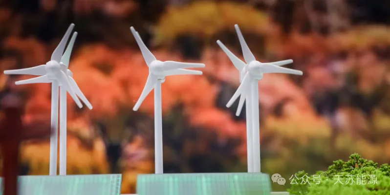
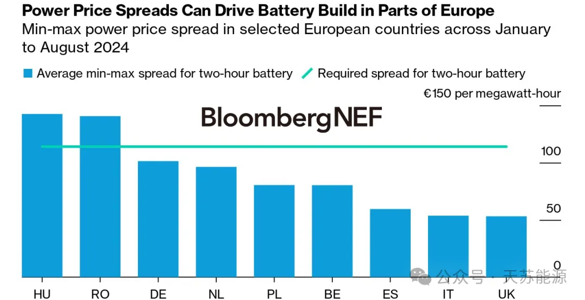
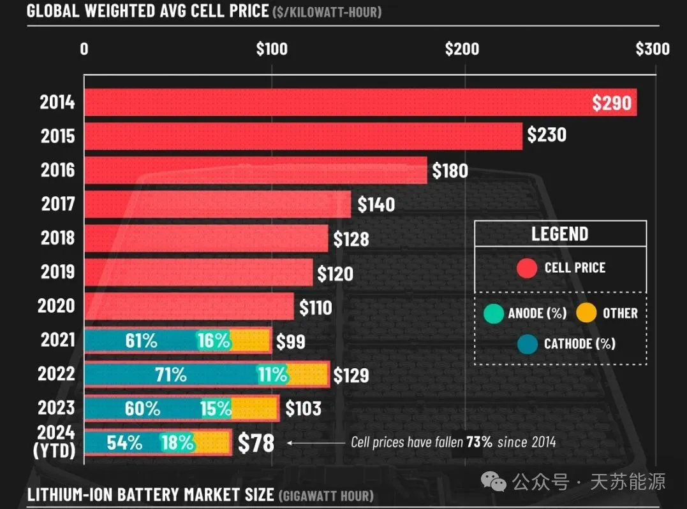
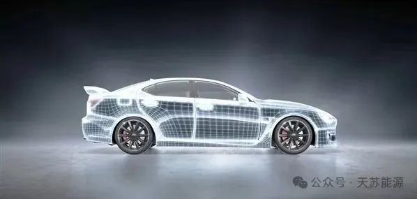
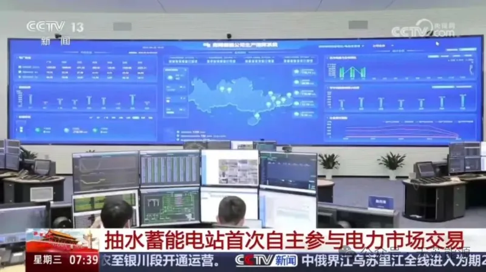
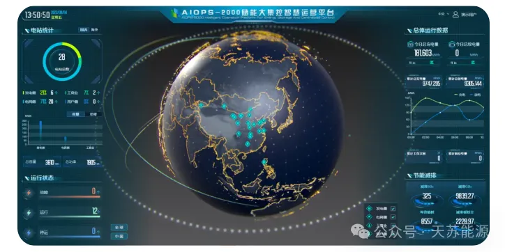
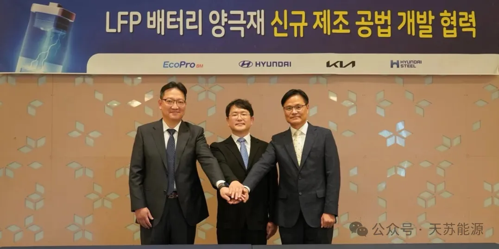
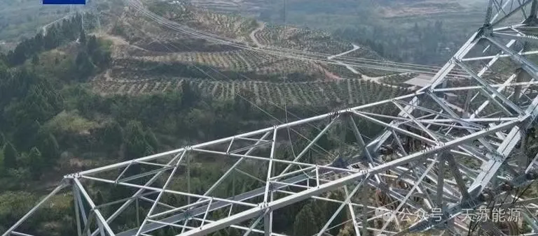
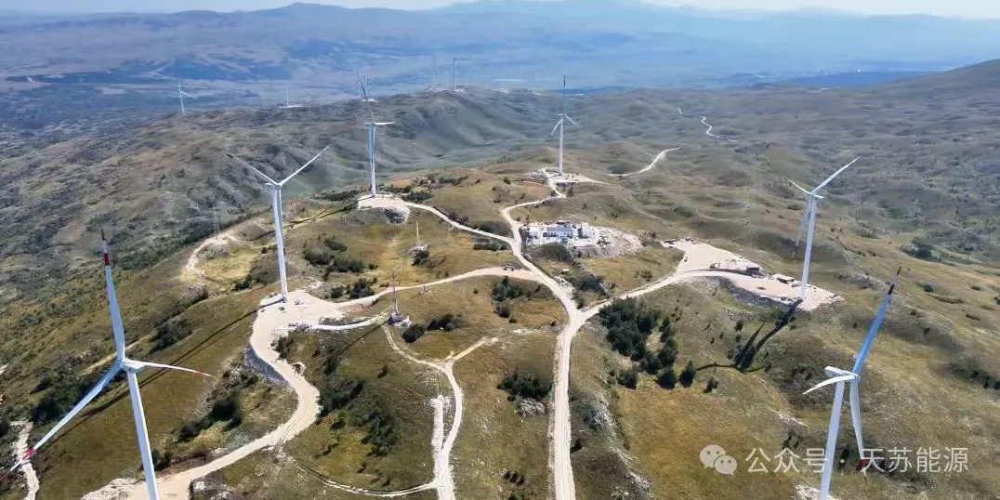

**2024 | 天苏十条 • 三十五期 | 09.30-10.06**

### ***天苏评***

> *自建国75周年以来，我国绿色能源事业蓬勃发展，绿意盎然，风光无限。在这一背景下，欧洲储能市场却呈现出波动性上升的趋势。尽管过去10年间锂电池价格大幅下跌73%，但欧盟纯电车销量同比仍暴跌近44%，显示出市场的不稳定。为应对这一挑战，系统优化成为关键，智算增速超65%，为能源管理提供了强大支持。同时，抽水蓄能电站首次参与电力市场交易，数据驱动安全储能管控系统也顺利通过鉴定，为储能安全提供了有力保障。在组件创新方面，现代起亚共同研发磷酸铁锂电池技术，为新能源汽车发展注入新动力。此外，全球最高海拔特高压项目建成，标志着我国在特高压输电领域取得了重要突破。值得一提的是，中国电建在欧洲的风电项目成功并网，这不仅展示了我国在风电领域的实力，也体现了我国企业在国际市场上的竞争力。综上所述，在绿色能源发展的道路上，我国正不断突破关键技术，优化系统管理，推动组件创新，为全球能源转型贡献中国智慧和中国力量。在面临市场波动和挑战的同时，我国能源事业依然保持了旺盛的生命力，展现出无限的发展潜力。*

## **市场政策**

### **一、75年，绿意更浓，风光无限**

我国新能源产业在过去**75年**里取得了举世瞩目的历史性成就，**从艰难起步到实现平价上网，再到领跑全球，建成完备全产业链条**，不仅推动了经济社会绿色低碳发展，还为全球应对气候变化和能源绿色转型作出了突出贡献。通过**坚持市场主导、鼓励创新，我国新能源产业实现了快速迭代，建成全球最大的电力供应系统和清洁发电体系，风电、光伏等技术走在世界前列，同时积极参与国际合作，为全球能源转型和碳中和目标作出了重大贡献。**

  

我国新能源产业已经成为一张靓丽的新名片，以**技术创新**为关键发力点，不断增强**产业链创新链**，形成**绿色可持续增长**的经济新动能。同时，我国**新能源产品和服务**也让全球范围内风光成本大幅下降，新能源技术加速迭代，走进千家万户，成为普惠大众的重要能源保障。未来，我国新能源产业将继续勇立潮头，以更新更强面貌让“中国名片”熠熠生辉。

### **二、欧洲储能市场波动性上升**

**欧洲电价价差今年正在扩大**，而此前2023年从2022年所创下的纪录水平回落。价差扩大的部分原因是**光伏渗透率提高导致德国和西班牙等市场的日间电价创下历史新低**。基于电价套利的商业模式——电价便宜时充电、电价昂贵时放电——进一步受益于电池价格下跌。受到套利应用青睐的两小时和四小时储能系统正在变得更加经济。

  

除电价价差扩大之外，电池价格下跌也提高了**基于套利的项目的生存能力**。2024年开发的两小时电池现需要在其生命周期中平均达到每日价差**114欧元/MWh（合127美元/MWh）**，才能实现投资者的目标，低于2023年的逾**150欧元/MWh**。

  

尽管有所改善，但电价价差本身仍不足以支持大多数市场的项目。匈牙利和罗马尼亚等南欧和东欧市场是例外，这些地区燃气发电成本高昂，导致峰值价格特别高。即使在价格波动较大的市场，开发商在没有收入确定性的情况下也会缓慢建设，因此**政府的支持继续加码**。过去一年宣布的国家援助总额超过**200亿欧元**，使2022年以来批准总额达到**220亿欧元**。

### **三、10年来锂电池价格下跌73%**

锂离子电池在充电过程中通过**收集电流并将其引导到电池中来运行**。通常，**石墨阳极**会吸引锂离子并将其作为电荷保留。在放电过程中，阴极吸收储存的锂离子并将其引导到另一个集电器。该电路有效地发挥作用，因为阳极和阴极不直接接触，而是悬浮在一种便于离子流动的介质中。目前，电池成本的**54%**来自阴极，**18%**来自阳极，**28%**来自其他组件。

  

锂离子电池的平均价格从2014年的**每千瓦时290美元**下降到2023年的**103美元**，2024年平均价格预计为**78美元/千瓦时**，比2014年下降**73%**。

### **四、欧盟纯电车销量同比暴跌近44%**

欧洲汽车市场今年8月遭遇重挫，新车销量大幅下降，尤其是**纯电动汽车**销量暴跌，导致德国和法国这两大电动车市场出现大幅下滑。这一趋势使得依赖欧美市场的韩国动力电池企业面临巨大挑战，其**市场份额和装机市占率**均有所**下滑**。为应对市场变化，韩国的LG新能源、三星SDI和SK On等电池企业纷纷推出新的商用车电池产品，希望通过电动商用车市场的增长潜力来实现转机。LG新能源展示了**高压中镍电池**，三星SDI推出了**磷酸铁锂电池和全固态电池**等新品，而SK On则完成了**磷酸铁锂电池**的研发，计划未来几年内开始生产。  

  

然而，韩国电池企业在寻求转机的过程中仍面临多重困难。市场竞争加剧，中国企业在动力电池领域的发展势头强劲，全球市场份额持续增长，而韩国企业的市场份额却在减少。此外，韩国电池企业在**供应链保障和技术路线拓展方面**存在不足，缺乏产业一体化发展基础，导致电池供应链降本难度大，且在磷酸铁锂电池技术的发展上难以追赶中国。尽管韩国企业推出了新品，但其规模化量产的时间表尚不明确，而中国企业的**动力电池新品**已在多个领域**加快渗透**，海外订单量和本地化产能不断增长，全球化竞争力持续提升，这对韩国电池企业构成了更大的挑战。

## **系统优化**

### **五、智算增速超65%**

2024年中国算力大会在郑州举行，展示了我国算力结构的不断调整和智算规模的强劲增长。截至今年6月，我国算力中心超过**830万**标准机架，算力规模达**246EFLOPS**，智能算力同比增速超**65%**。工信部表示将强化规划设计，**统筹算力增长和质量提升，完善建设布局和多元配置机制**，面向新兴产业建设智算中心。我国算力基础设施发展显著，算力互联互通深入推进，总规模世界领先，且算力正加速**赋能各行业**，如超级计算郑州中心大幅缩短种子育种周期，河南省儿童医院通过智能诊疗平台提供个性化服务。同时，**AIGC**等新业务推动智能算力需求增长，但**AI时代**对网络提出新挑战，需要更高性能和效率的算力支持。

  

展望未来，将完善规划设计、**建设布局和互联互通机制**，促进东**西部算力互补和协同**，构建算力互联规则，服务**统一大市场建设**。紫光股份董事长于英涛建议客观测算算力需求，统筹智算中心布局，创新运营模式，提高利用率，防止算力空置，保持**投资良性循环，以科学谋划智算中心建设**。

### **六、抽水蓄能电站首次参与电力市场交易**

10月2日，中央电视台《朝闻天下》报道了南方电网梅州抽水蓄能电站自10月1日起全电量进入电力现货市场交易的消息，**这是我国抽水蓄能电站首次自主参与电力市场交易，标志着抽水蓄能市场化经营的新路径**。梅州电站每天可**自主申报次日的抽水发电能力和预期电价**，通过市场机制**实现低价买电抽水、高价放水发电**，提高了机组运行灵活性和启动次数，有效增加了新能源的消纳能力，并在试运行期间显著**提升了系统负荷调节效率**。

  

此外，我国计划到**2030**年将抽水蓄能装机规模提升至**1.2亿千瓦**，是目前的**2.2倍**。通过试点先行、逐步扩大的方式推动抽水蓄能参与电力市场交易，将不断加强新型电力系统的调节能力，促进抽水蓄能产业的健康有序发展，为**保障间歇性、波动性新能源的稳定接入电网提供支持**。

### **七、数据驱动安全储能管控系统鉴定通过**

新源智储能源发展（北京）有限公司研发的“**基于数据驱动的无人化主动安全储能电站智慧运营集中管控系统**”通过了技术成果鉴定，由中国电机工程学会组织，以中国工程院院士罗安为首的专家团队确认其成果达到国际先进水平，多项技术国际领先。该系统针对储**能电站的安全隐患、调度可靠性、运维检修和运营决策**问题，实现了**监控集中化、分析智能化和业务数字化**，有效降低运维工作量和安全风险，提升设备运营可靠性和决策智能化。

  

该系统具有三个创新点：一是建立了一体化的储能电站数据管理体系，提升数据管理效率；二是研发了数据驱动的主动安全管理系统，提高电站运行可靠性和安全性；三是提出了电力市场量价预测和运营优化方案，实现了智慧运营集中管控。该解决方案已在多个省份的储能电站工程中应用，显著提升了**电站安全性和调度可靠性，为我国新型电力系统建设提供了有力支持。**

## **组件创新**

### **八、现代起亚共研磷酸铁锂电池技术**

9月26日，韩国现代汽车集团宣布，**现代汽车和起亚汽车**已经启动**磷酸铁锂（LFP）电池正极材料**生产技术开发项目。

  

现代汽车集团在一份新闻稿中表示，LFP电池正极材料开发项目是现代汽车、起亚汽车与现代制铁（Hyundai Steel）和正极材料市场龙头企业EcoPro BM合作推进，目的是**在不制造前驱体的情况下直接合成材料，生产LFP电池正极材料**。该项目为期四年，已经获得了韩国贸易、工业和能源部的支持。

  

现代汽车和起亚汽车电气化及电驱动材料研发负责人Soonjoon Jung表示，“为了满足未来电动汽车市场的需求，快速的技术开发和有效的电池供应链建设是必不可少的。我们的目标是通过该项目，**减少对进口产品的依赖，并通过内部开发必要的技术，提高国家和现代汽车集团的技术竞争力。”**

### **九、全球最高海拔特高压建成**

**金上～湖北±800千伏特高压直流输电工程线路工程渝西段（设计包8段）全线贯通**，永福股份负责线路设计包8的勘察设计工作。金上特高压工程是**国家“十四五”规划的重要输变电工程之一**，是**全球最高海拔特高压工程**。其中渝西段在重庆境内途经潼南、铜梁、合川3区，工程新建特高压直流线路约**91.883公里**。该项目对促进金沙江上游水电消纳，助力藏区经济社会发展，提升华中电网电力供应保障能力具有重要意义。

  

金上特高压工程渝西段施工环境复杂多变，地质条件多样，各类跨越作业难度大。永福股份电网团队充分贯彻**“六精四化”**建设要求，以精益的特高压勘察设计方案，解决了多个项目难点。

### **十、中国电建欧洲风电项目并网**

在中华人民共和国成立**75周年**之际，由**中国电建**投资建设的**波黑伊沃维克风电项目**成功并网发电，这不仅标志着中国与波黑经贸合作的进一步深化，也展现了**中国标准、技术、设备一体化**“走出去”的实力。伊沃维克风电项目作为波黑的重大国家项目和首个中资能源投资项目，位于波黑联邦第十州，总装机容量**84兆瓦**，预计年发电量**2.59亿度**，采用中国国产风机机组，实现了国产设备在东欧新能源项目中的首次大规模应用，且全场设备国产化率超过**90%**，项目建设期间为当地创造超过**100个**就业岗位，运营后将显著减少二氧化碳排放，促进当地经济社会发展。

  

该项目以其高效的**建设速度、环保零投诉**的记录以及为当地带来的经济和社会效益，获得了**波黑2022年度最佳外国投资者奖**，成为中国企业首次获此荣誉的典范。伊沃维克风电场的建成对波黑优化能源结构、推动高质量发展具有深远意义，同时它也是中波绿色能源领域合作的精品工程，体现了**中国电建在推动“一带一路”高质量发展中的绿色行动和生态责任**。

---

