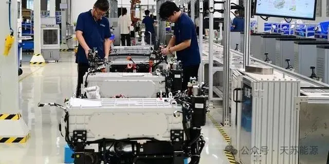

**2024 | 天苏十条 • 三十期 | 08.25-09.01**

### ***天苏评***

> *全球新能源市场风云激荡，本期继续跟进本周全球新能源领域的动态。国产氢燃料电池发动机在2024年三季度实现了大规模生产，金华氢途科技公司正全力以赴赶制氢燃料电池。HD KSOE以约8000万美元收购芬兰Convion，增强在氢燃料电池市场的竞争力。百誉控股以7.5亿元人民币收购深圳金通源，进入储能电池市场。英国政府部长称赞液流电池的高安全性和长寿命，认可其推动了技术进步。美国加州启动了8.5 MW/293 MWh的绿色氢储能项目，旨在为城市提供可靠稳定电力。西安交大的研究团队在有机液流电池领域取得突破，开发了成本低、性能高的电解液材料。空客与亨睿碳纤维科技公司合作，在航空领域推动绿色经济。云南省最大新能源项目投产，将每年输送14亿千瓦时清洁能源。鹏辉能源发布了20Ah和2000mAh两款固态电池，显著降低成本。FuelCell Energy展示了二氧化碳回收和利用的创新技术，深度推动绿色能源的应用。*

## **市场政策**

### **一、国产燃料电池发动机冲刺三季度**

在**2024年三季度**，**国产氢燃料电池发动机的生产呈现出繁忙的景象**。例如，金华氢途科技有限公司的工人正在全力以赴地赶制一批氢燃料电池发动机，以满足订单需求并努力冲刺三季度。这家公司是一家专注于氢燃料电池的研发、生产和销售的创新型企业，其燃料电池系统在**功率等级、氢气利用率、功率密度、可靠性和寿命**等关键技术指标上具有显著优势。该公司生产的**车用燃料电池产品**功率覆盖从**20kW**到**240kW**，主要用于**公交车、物流车、重卡和客车等多个车型**，其产品已远销至江苏、广东、四川、山西等十多个省市。

  

此外，氢燃料电池行业的成本降低主要通过两种路径：一是**规模效应带来的单位成本下降**，二是**零部件国产化替代**。目前，电堆、空气压缩机、膜电极等**五项**关键零部件的国产化率已经**超过80%**，尽管碳纸、质子交换膜、催化剂的进口比例仍然很高。近年来，随着政策的支持和引导，氢燃料电池市场的活跃度明显提升，装机量逐年提高。预计随着技术进步和成本下降，氢燃料电池在重卡、大巴等交通领域的应用将持续快速增长。

### **二、HD KSOE收购Convion**

**HD韩国造船与海洋工程公司(**HD KSOE)最近通过其子公司HD Hydrogen，以约**8000万美元**收购了芬兰公司Convion的大部分股份。Convion成立于**2012年**，专业从事**固体氧化物燃料电池**(SOFC)和**固体氧化物电解槽(**SOEC)技术。此次收购使HD KSOE能够进入全球氢燃料电池市场，并在进入市场时取得先发制人的效果。  

  

Convion是少数几家开发了**商用SOFC发电系统技术**并推向市场的公司之一。通过收购Convion，HD KSOE希望利用SOFC和SOEC技术在氢能源领域的关键地位，实现市场领先。HD KSOE还计划以双轨战略领导市场，其中HD Hydrogen将主导韩国的发电和海洋事业，而Convion将继续开发核心燃料电池技术，并主导欧洲事业。根据**国际能源署(IEA)和国际可再生能源署(IRENA)**的数据，氢燃料电池和水电解市场的预计将从**2023年的2.5万亿韩元(约18.5亿美元)**扩大到**2030年的17万亿韩元(127亿美元)**，年均增长率为**30%**，主要由**陆上发电推动**。预计到**2040年**，市场规模将达到**55万亿韩元(约411亿美元)**，特别是随着海洋氢燃料电池的全面应用和水电解技术的商用化。

### **三、百誉收购储能电池、锂电池企业**

百誉控股有限公司近期宣布，通过其全资子公司深圳百誉巨成数据科技有限公司，与深圳金通源储能科技有限公司签订了最终股份购买协议。这次收购**标志着百誉正式进军可再生能源储能电池市场**。金通源是一家专注于**储能电池、充电桩及锂电池产品**研发的**中国科技企业**。此次收购是百誉在可再生能源储能电池市场的重要里程碑。  

  

根据协议，百誉将以**人民币7.5亿元**（约合**1.05亿美元**）的现金对价分期支付方式，收购金通源100%的股权。该交易已获得公司董事会的批准，预计将于**2024年9月**完成交割。金通源主要从事储能电池、充电桩及锂电池产品的研发、设计、运维、销售及售后服务，致力于成为全球领先的储能电池、充电桩及锂电池产品运营服务商。其产品目前主要应用于电力电车、高尔夫球车、叉车等各类大型电动车辆，并**专注于北美市场**。

### **四、英国政府部长盛赞液流电池**

2**液流电池**作为一种新型的储能技术，近期受到了**英国政府部长**的盛赞。这种电池技术有几个显著的优势，例如不会着火、不会退化，因此**安全性高**，**使用寿命长**。液流电池利用溶解在液体中的**活性物质**，在离子膜两侧进行**氧化还原反应**来储存和释放能量。由于活性物质是储存在外部储罐中的液体电解质，其输出功率和储能容量相互独立，具有良好的可拓展性能。  

  

近年来，液流电池技术得到了快速发展。例如，**2022年**全球储能装机量显著增长，液流电池开始成为储能领域的新贵。**全钒液流电池技术因其成熟而成为实用化的主流**，许多研究机构和公司都在致力于其产业化开发。除了全钒技术，其他如锌基和全铁等技术也在国外有所布局。液流电池的安全性和环境友好特性使其在新能源发电领域具有广阔的应用前景。例如，与锂电池相比，液流电池在充放电过程中不涉及物相的变化，因此**循环寿命可达上万次**，整体使用寿命可以达到**20年**或更长时间。此外，液流电池在充放电过程中一般**不燃烧、不起火**，安全性能突出。

## **系统优化**

### **五、美国最大绿色氢储能项目建设**

美国加州正在建设其**最大的绿色氢储能项目**，该项目位于**加州北部的卡利斯托加**，拥有**8.5 MW**的发电能力和**293 MW/h**的储能容量。这个项目旨在保护加州**城市免受野火引发的断电影响**，确保在公共安全断电(PSPS)期间，该市市中心能够正常运行长**达48小时**。项目将使用**绿色氢为燃料电池供电**，然后为瑞士开发商Energy Vault提供的锂离子电池充电。Energy Vault将负责该项目的运维，已于**2024年6月底**完工。根据与太平洋燃气和电力公司(PG&E)达成的**10年半**协议，该项目将向**超过2000名**客户提供可调度电力。

  

绿氢作为一种新型绿色能源，具有广阔的发展前景。到**2050年**，世界绿氢市场容量预计将**超过40000亿**，氢气需求量达到**3.2亿吨**。绿氢可用于生产和发电，目前生产发电的方式主要有燃料电池和燃气轮机。随着环境污染问题受到高度关注，越来越多的国家和公司投资于绿氢产业的发展，加快了绿氢的推广和应用。

### **六、西安交大有机液流电池获新进展**

**西安交通大学**前沿院何刚教授课题组在**中性水系有机液流电池(AORFBs)**研究领域取得了重要进展。他们的研究重点是**开发高性能的电解液材料**，这是液流电池能量存储的核心单元，其成本占系统总成本的**50%以上**。特别是，他们关注的是**萘二酰亚胺材料**，这种材料因其独特的平面刚性结构以及优异的双电子存储特性而备受关注。

  

为了解决萘二酰亚胺衍生物作为负极电解质材料所面临的**高浓度性能不足和制备成本高昂**的问题，何刚教授的团队在前期工作的基础上，利用结构改性修饰策略以及优化制备工艺，在核心萘环末端引入亲水基团。他们通过**水热合成技术**实现了萘二酰亚胺材料实验室级百克尺度的制备，其中dex-NDI的水溶性**高达1.85 M**，成本则低至**0.16 g-1**。**该研究首次提出了水热合成技术规模化制备萘二酰亚胺衍生物的普适方法，阐明了分子间堆积和氢键网络的协同作用，为电解质材料的设计合成提供了新的思路，也为水系有机液流储能技术从实验创新到大规模制造的商业化发展奠定了坚实的基础。**相关研究成果发表在国际化学领域权威期刊《德国应用化学》(Angewandte Chemie International Edition)上，并被选为VIP(Very Important Paper)和Back Cover文章。

### **七、空客与HRC合作发展航空绿色经济**

**空中客车飞机**全生命周期服务中心(ALSC)与**亨睿碳纤维科技有限公司**(HRC)于**2024年8月29日**在**成都**签署了战略合作协议，**正式启动了国内首个飞机拆解和循环利用项目**。这一合作标志着**航空产业在绿色可持续发展方面**的重大进步。

  

根据合作协议，双方将聚焦于**退役飞机机体的拆解回收和复合材料的循环再利用**。他们计划开展技术及产品领域的深度合作，共同推动航空产业的绿色可持续发展。空中客车飞机全生命周期服务中心是**全球唯一由飞机制造商运营的飞机循环利用项目**，位于成都的合资公司也是空客集团在欧洲之外的首个飞机全生命周期服务项目。首架参与拆解和循环利用的飞机是**A330-200型号**。这次飞机的拆解将由空中客车飞机全生命周期服务中心、空中客车中国研发和创新中心(ACRI)以及HRC共同完成。拆解的航材部件将根据规定回流至航空业继续使用，降低飞机运营成本。HRC将负责回收飞机的碳纤维复合材料，通过绿色专利技术进行资源再利用。这一合作不仅有助于**推动航空产业的绿色可持续发展**，还将带动相关产业链的发展.

## **组件创新**

### **八、云南最大规模新能源项目投产**

**云南省****最大的“源网荷储”一体化新能源集群项目**已于**2024年8月28日**正式建成投产。该项目核心是永仁县独立共享储能站，该站正式接入南方电网**500千伏**光辉变电站。该项目建成投产后，预计每年可输送**14亿千瓦时**清洁能源，相当于节约标煤**43.9万吨**，减少二氧化碳排放**96.7万吨**。

  

这个项目的总投资接近**200亿元**人民币，是**云南省加快构建新型电力系统、推动实现碳达峰、碳中和目标的重要工程**。项目通过整合楚雄片区的光伏电源、500千伏光辉输变电工程、相关用户和永仁致信独立共享储能示范项目，,确保了清洁能源的**最大化吸收和最优化配置**，还提高了新能源的消纳能力及区域电网的安全运行水平。项目电源端接入了楚雄永仁、大姚、元谋三县的**12个**新能源场站，总容量达到**300万千瓦**。同时，还**配套新建了一座功率为****300兆瓦**、**储能容量****600兆瓦时****的磷酸铁锂电池储能电站**，作为支撑电源接入变电站。永仁致信**300兆瓦/600兆瓦时**独立共享储能示范项目配备了**179台**储能电池舱和**1座220千伏**升压站。储能电站采用“削峰填谷”运行方式，预计年平均放电量为**1.8亿千瓦时**，对电网电力电量平衡起到了有效的调节作用。

### **九、鹏辉固态电池实现两大突破**

**鹏辉能源**在**2024年8月28日**举行了产品技术发布会，展示了包括**固态电池**在内的**多****项电池技术创新**。此次发布的新品包括**户用储能低温电芯POLAR系列、590Ah风鹏电芯**以及**第一代固态电池技术**。

  

鹏辉能源的固态电池技术取得了显著进展，发布了**20Ah和2000mAh**两款**软包全固态电池**。这些电池采用了**自主研发的高离子电导率、高稳定性、低成本的氧化物复合固态电解质**，实现了固态电池在工艺和材料上的双向突破。**在工艺创新方面**，鹏辉能源自主研发了独特的电解质湿法涂布工艺，成功绕开了氧化物固态电解质高温烧结过程，避开了陶瓷材料固有的脆性。采用此工艺的固态电池，整体成本相较常规锂电池成本预计仅高出**15%**左右。**在材料创新方面**，鹏辉能源的固态电池采用了自主研发的无机复合固态电解质层，除了氧化物电解质之外，这一电解质层还结合了新型无机复合粘结剂和功能添加剂等关键材料。当前，鹏辉能源的低温户储电芯POLAR系列**50Ah**、**72Ah**、**100Ah**已量产交付，而风鹏电芯**590Ah**预计将于**2025年第四季度**正式量产。

### **十、燃料电池公司参加世界酿酒大会**

**FuelCell Energy** 参加了世界酿酒大会(World Brewing Congress)，因为该公司在**酿造、食品和农业行业**中提供了**二氧化碳利用和可持续发展**的创新解决方案。这些行业对二氧化碳的需求很大，因为它在啤酒气泡、食品保鲜、加工甜点以及维持水的pH值平衡中都扮演着重要角色。  

  

该公司的**熔融碳酸盐燃料电池技术**为客户提供了三个显著的优势：**基载电力的自给自足、减少锅炉排放的蒸汽或热水供应**，以及**食品和饮料级二氧化碳的即时消耗或储存**。这些解决方案有助于确保食品和饮料公司基本生产要素供应的稳定性，提供长期的价格透明度，并降低整个生命周期范围内的排放量。FuelCell Energy 还在康涅狄格州托灵顿投资建设了一个全面运营的**二氧化碳回收示范工厂**，该工厂每天将回收**10吨**饮料级二氧化碳。此外，FuelCell Energy 提供了一个**碳捕获平台**，使用碳酸盐燃料电池从外部来源捕获二氧化碳，同时发电。这种技术可以降低碳捕获的经济成本，并为实现**净零排放**提供了一个切实可行的解决方案。

---

