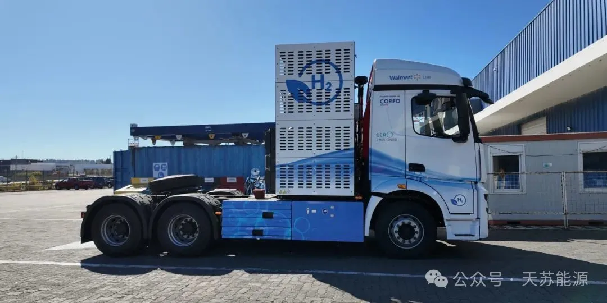

**2024 | 天苏十条 • 三十二期 | 09.08-09.15**

### ***天苏评***

> *在应对气候变化日益紧迫的背景下，全球能源行业正经历一场深刻的转型。这场转型的驱动力来自于创新技术的不断开发与应用，目标直指减少温室气体排放、提升能源效率，以及促进可再生能源的广泛利用。中国化学公司通过中标全球最大的绿氢制绿色甲醇项目，展现了其在推动可再生资源转化为清洁燃料方面的坚定承诺。与此同时，中海储能的源网荷储一体化战略，不仅提高了能源利用效率，还增强了电网的稳定性和可靠性，为能源行业的持续发展开辟了新路径。*

> *在氢能领域，国鸿氢能与高校的战略合作，以及硅基燃料电池技术获得的显著投资，凸显了氢能作为未来能源的关键角色。这些合作和资金注入加速了氢能技术的商业化，为交通和电力行业中的应用打下了坚实基础。*

> *电池技术的进步同样显著，钠氧化铝固态电池的研发进展和罗马尼亚新建的甲醇燃料电池设施，都标志着能源存储和转换技术的重要进展。在国际市场上，飞驰氢能重卡的拉美市场拓展和奔驰全固态电池的即将投产，标志着清洁运输技术的全球推广。这些举措不仅有助于降低交通领域的碳排放，也推动了全球向低碳经济的转变。西门子能源提供的100MW电解槽和肯尼亚推广的生物质颗粒清洁气化炉灶，进一步展示了绿色氢能和清洁烹饪技术在改善环境质量和提升公共健康方面的巨大潜力。*

> *从绿色甲醇到固态电池，从氢能重卡到清洁烹饪技术，全球能源行业正通过一系列创新项目和战略合作，逐步迈向一个更清洁、更高效的能源体系。这些进展反映了全球对于实现可持续发展和应对气候变化挑战的集体承诺。随着这些技术的不断成熟和应用，我们有理由相信，未来几年将见证能源行业的深刻变革。*

## **市场政策**

### **一、中国化学中标绿氢制绿色甲醇项目**

中国化学所属的十四公司近日中标了西南化工研究院金风绿能绿氢制**50万吨**绿色甲醇项目(一期25万吨)甲醇装置建安工程。这个项目位于内蒙古自治区兴安盟经济技术开发区，是**全球最大的绿色甲醇项目**，也是**中国首个应用大规模风电绿色甲醇的项目**。

  

该项目的建设内容包括生物质发电装置、绿色甲醇合成装置等主要生产线及配套公辅工程。项目采用了**风—氢—储—生物质多能协同耦合技术**，实现了大规模风电等波动性能源的高效利用，并打通了可再生能源与绿色燃料的耦合工艺，为新能源制氢向化工行业的发展开辟了新路径。项目的总投资约为**30亿元**人民币，计划分两期建设，其中一期建设**25万吨/年规模**，二期同样建设**25万吨**规模。项目一期**25万吨**生物质加工及合成气制备装置的竞争性磋商公告已发布，采购范围包括**3个标段**，分别为**5万吨、10万吨、10万吨**合成器装置。接下来，十四公司将紧扣中国化学的“135”发展战略，强化全局意识，坚持在新兴产业和传统产业两端发力，将技术优势、资源优势转化为市场优势和项目优势，为**五年时间**内再造一个更高质量的中国化学蓄势赋能。

### **二、中海储能构建源网荷储一体化**

中海储能科技(北京)有限公司(简称中海储能)是一家专注于**铁铬液流电池储能技术**的研究开发、生产制造与商业化应用的**科技型企业**。该公司以铁铬液流电池技术为支撑，致力于**打造源网荷储一体化的综合能源应用模式。**铁铬液流电池具有**低成本、大规模、长寿命和强安全**的特点，适合用于大**规模长时储能场景**，对于促进新能源的消纳、提升电力系统运行效率和电源开发综合效益具有重要作用。  

  

中海储能的铁铬液流电池技术经过多年的研发和试验，已经实现了技术上的突破，解决了析氢与铬反应活性差等问题，并完成了铁铬液流**电池走向商业化**的必要准备工作。中海储能积极参与国家关于电力源网荷储一体化和多能互补发展的指导意见，通过优化整合**本地电源侧、电网侧、负荷侧资源**，探索构建源网荷储高度融合的新型电力系统发展路径。它与沙特ULTIM公司签署了铁铬液流电池长时储能项目协议，这是推进共建“一带一路”绿色发展的重要实践，也是沙特“**2030**愿景”新能源计划的重要组成部分。

### **三、国鸿氢能签署校企战略合作协议** 

**国鸿氢能**与**重庆理工大学**于**2024年9月11日**签署了校企战略合作协议。根据协议内容，双方将共同探索**产教融合模式**，共建国鸿氢能-重庆理工氢能技术校企合作研发中心。合作领域包括**燃料电池系统技术开发、燃料电池零部件技术研究、燃料电池控制策略研究以及燃料电池汽车整车水热管理等关键技术攻关**。此外，双方还将在产业人才培养、成果转化、创新创业和双选招聘等方面展开合作，以推动双方的创新发展。

  

九龙坡区政协副主席陈旭川对合作给予了高度评价，并期待双方共同打造氢能产业的标杆项目。此次合作是国鸿氢能在**西南地区**战略布局的重要一步，旨在结合双方优势，推动大功率氢燃料电池技术、车载氢能源系统集成和控制等技术的研发与应用，为我国能源结构的绿色转型贡献力量。签约仪式前，双方还参观了新能源汽车现代产业学院，深入了解了学院的科研成果及人才培养情况。

### **四、硅基燃料电池获得700万美元投资**

**施正荣博士**，著名的太阳能光伏企业家，最近再次出山，他的新项目是突破性的**硅基燃料电池技术**，这一技术已经获得了**700万美元**的投资。这项技术由澳大利亚初创公司Siltrax开发，它使用由**硅制成的双极板**，而不是传统的石墨或金属材料，以生产更薄、更高效的极板。硅材料的化学稳定性使其能够承受**高压、高温和酸性环境**，而**不会降解**，这有助于降低燃料电池的生产成本，并提高其耐用性、效率和性能。此外，使用硅还允许Siltrax利用现有的光伏供应链来提供原材料和生产设备。

  

Siltrax技术的潜在应用包括固定式发电、重型长途卡车运输、材料搬运车如叉车，以及**航空航天应用**。此外，该公司还在利用相同的核心技术推进**氢电解槽**的开发。这项技术的进步对于减少交通排放具有重大意义，并且有助于推动向低排放经济的转型。施正荣博士在光伏和半导体制造方面的经验，以及他在技术商业化和制造规模扩大方面的专业知识，对于Siltrax的成功至关重要。这次投资由**清洁能源金融公司(CEFC)**提供，将帮助Siltrax建立其在澳大利亚的研发团队，并专注于**燃料电池**系统工程和当地商业化机会。

## **系统优化**

### **五、钠氧化铝固态(SAS)电池进展顺利**

Altech Chemicals 与德国的 Fraunhofer IKTS 合作，共同推进了**新型 Cerenergy 钠氧化铝固态(SAS)电池**的商业化。双方早期签署了一项合资协议，成立了名为 Altech Batteries GmbH 的新公司,该合资公司专注于在德国工业园区建设一个产能为**每小时 100 兆瓦的电池厂**。

  

这个工厂预计每年能生产多达 **10,000个10千瓦/小时**的Cerenergy模块，每个模块的售价最高可达**13,200美元**。这些模块专为**电网(固定)储能市场**设计，并已在德国进行了广泛的性能测试。Cerenergy 技术采用普通食盐(氯化钠)和镍，不含有锂、钴、石墨和铜，从而降低了**关键金属价格上涨和供应链问题**的风险。根据计划，这座位于萨克森州的工厂每年将生产 **1600个60kWh**的电池组。目前，初步的工厂和场地布局已经完成，主要设备供应商已经确定，正在进行整合规划。Altech 还在准备一份明确的可行性研究(DFS)，以证实 CERENERGY 电池的销售成本比锂离子电池便宜**大约40%**，主要原因是不含锂、石墨、铜或钴。此外，CERENERGY 电池单元的能量密度为**130Wh/kg**，位于清洁能源研究所锂离子电池能量密度范围的低端，这意味着**CERENERGY 更适合储能系统(ESS)领域**。Altech 正在德国和欧盟探索州和联邦一级的资助计划，以支持该项目的融资，以及商业融资的银行。

### **六、罗马尼亚开设甲醇燃料电池设施**

SFC Energy AG，一家专注于**氢和甲醇燃料电池固定式和移动混合电源解决方案**的领先供应商，最近在罗马尼亚开设了**迄今为止最大的甲醇燃料电池生产设施**。这一举措是该公司全球扩张和增长战略的一部分，旨在满足对清洁能源解决方案不断增长的需求。

  

SFC Energy AG 提供的产品和服务包括各种燃料电池和集成解决方案，这些解决方案以其可靠性、自给自足和环保特性而著称。它们广泛应用于**政府和企业车辆、以及其他移动或固定离网应用**中，确保不间断的电力供应。公司在全球销售其屡获殊荣的产品，至今已售出超过**65,000块**燃料电池。根据**全球氢能网**的报道，SFC Energy AG 的中期销售目标到**2028年**调整至**5亿欧元**，显示出公司对燃料电池市场的坚定信心和快速增长预期。这一目标基于公司的三大增长支柱：进一步的市场渗透和区域扩张、技术扩张和知识产权开发、以及无机/收购增长。公司还计划到**2024年底**推出模块化氢燃料电池解决方案，输出功率高达**200KW**，进一步巩固其在技术领先地位。

### **七、飞驰氢能重卡进军拉美市场**

飞驰科技近日成功将其自主研发的**49吨**氢燃料电池重卡出口至**智利**，这标志着**中国首辆氢燃料电池重卡正式进入南美市场**。这款氢能重卡可满足**城际货运、省际长途**等多种商业运输场景，具备高端品质、综合性能、能耗控制、续航能力和可靠性能等国际领先水平的特点。  

  

飞驰科技的这一举措不仅标志着其在**海外业务**布局上的进一步扩展，也是其在**氢燃料电池重卡多元化应用场景**中的重要里程碑。飞驰氢能重卡的引进，不仅是智利优化物流运输方式、改善公共交通环境的重要步骤，也是其绿氢战略推广的一部分。这款**49吨**的氢能重卡搭载高性能燃料电池系统，具有**超长续航、超低氢耗、超低运营成本、安全和零碳环保**等特点，非常适合智利**多山区**的复杂工况。飞驰科技表示，未来将继续积极践行双碳战略，依托母公司**美锦能源**以及自身在氢能领域的领先优势，深化本土化发展，并大力拓展海外市场，寻求新的合作机遇。这不仅为中国氢能产业走向海外蓄势赋能，也为**全球绿色交通事业**的发展做出更大贡献。

## **组件创新**

### **八、奔驰全固态电池将于2030年前投产**

**奔驰公司**(Mercedes-Benz)正在与美国电池技术公司Factorial Energy合作开发新一代**固态电池技术**，目标是在**2030年前**实现商业化生产。这种名为Solstice的固态电池具有**450瓦时每千克**(Wh/kg)的能量密度，几乎是目前**锂离子电池**能量密度的**两倍**。这种电池技术预计将使电动汽车的续航里程提高**高达80%**。  

  

Solstice电池采用了硫化物基的固态电解质和新型的干式阴极设计，旨在提高生产效率和可持续性。Factorial Energyd的FEST(Factorial Electrolyte System Technology)平台是这项技术的基础，它使用**锂金属阳极和硫基电解质**。这种设计减少了火灾风险，因为不含易燃的液态电解质，并且提供了更大的温度稳定性，从而减少了电池组的冷却需求。奔驰公司已经在**2022年**领导了对Factorial Energy的**2亿美元**投资回合，并且已经收到了首批电池样品。Factorial Energy还与**Stellantis、现代汽车和起亚**等其他汽车制造商有合作关系。奔驰公司还与台湾的ProLogium公司合作，共同开发**能量密集型**的电池单元，预计这些电池单元将“几乎**翻倍于**今天的传统锂离子电池单元的续航里程”。奔驰公司计划在几年内将这些电池技术整合到一系列乘用车中，并在**2030年**前在市场条件允许的情况下实现全电动化。

### **九、西门子能源提供100MW电解槽**

**西门子能源公司**已与汉堡绿色氢能中心(HHGH)签署协议，将为其提供**100兆瓦(MW)**的电解槽容量，预计将于**明年**安装。汉堡绿色氢能中心由资产管理公司Luxcara和市政公用事业公共同开发，**今年2月**被欧盟指定为欧洲共同利益重要项目(IPCEI)，获得了政府的大力支持。**7月**，德国联邦政府和汉堡市联合向该项目拨款**2.5亿欧元**，用于建设与之相连的HH-WIN氢气管道网络的**前40公里**。  

  

西门子能源公司将提供**六台**大型**质子交换膜(PEM)电解槽**，这些电解槽的年产能可达**10000吨**氢气。**PEM电解槽通常比碱性技术更昂贵，但更适合间歇供应可再生能源。**这些电解槽将在西门子位于柏林的超级工厂生产，该工厂是西门子与液化空气集团**75:25**合资企业的一部分。与HHGH的协议还将包括一份为期**十年**的维护合同，商业运营计划在**2027年**开始，该技术使用电力**通过膜分离水为氢气和氧气**，特别适合与动态供应的可再生能源一起运行，因为其在生产上具有固有的灵活性。

### **十、肯尼亚推广生物质颗粒清洁气化炉灶**

非洲现代烹饪设施公司(MCFA)与ACE混合能源肯尼亚有限公司以及Better Cooking公司签署了协议，以**推广清洁烹饪**解决方案。ACE混合能源肯尼亚有限公司将销售其设计的**ACE One气化炉**，这种炉灶是一种**太阳能/生物质混合能源系统**，能够清洁地燃烧任何类型的固体生物质。它还包括**PAYGo功能和物联网**使用监控，通过风扇小时数和USB使用数据收集来监测炉子的使用情况。MCFA提供的基于成果的融资将支持ACE混合能源肯尼亚有限公司销售**1.3万个炉灶**，预计到**2028年底**将为**肯尼亚**多达**6.5万人**提供清洁烹饪解决方案。  

  

Better Cooking公司，以EcoSafi的名义，提供高效炉灶，并定期供应由**农业废弃物制成的生物质颗粒燃料**。该公司的炉灶和燃料旨在提供一种清洁、负担得起和可持续的木炭烹饪替代品。MCFA为Better Cooking公司提供了高达**150万**欧元的基于成果的融资，目标是在肯尼亚建立**25,000个**可持续清洁烹饪服务.这些努力是肯尼亚推动清洁烹饪和减少室内空气污染的重要步骤，有助于改善公共健康和环境质量。通过提供负担得起的清洁烹饪解决方案，这些公司和组织正在帮助肯尼亚家庭过渡到更健康、更可持续的生活方式。

---

