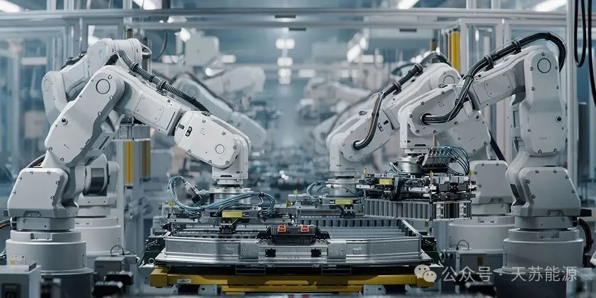

**2024 | 天苏十条 • 三十四期 | 09.16-09.22**

### ***天苏评***

> *面对气候变化逆转发展成果的挑战，全球正加速推进能源转型和系统优化。美国能源部计划投入超过30亿美元以支持电池技术的发展，这一举措有望为可再生能源的广泛应用提供强有力的支持。在此背景下，蜂巢能源赞助了第11届电池“达沃斯”，促进了国际间在电池技术领域的交流与合作。同时，非洲氢能峰会在纳米比亚的成功举办，标志着氢能产业在全球范围内的关注和潜力。中国可再生能源产业的快速发展带来了新的机遇，国内首个光热储能光伏风电项目的投产和新能源车零售63%的同比增长，展现了中国在推动绿色能源转型方面的积极成效。在组件创新方面，Delectrik推出的液流电池解决方案和硫化物固态电池研发的新进展，为电池技术的革新提供了新的动力。然而，西班牙电池市场可能面临的蚕食风险，提醒了行业在快速发展同时，也要关注市场结构和竞争态势的变化，以确保可持续健康发展。*

## **市场政策**

### **一、气候变化逆转发展成果**

世界气象组织发布的《团结在科学之中》报告显示，**全球距离实现关键气候目标尚远，气候变化和恶劣天气正逆转发展成果，威胁人类与地球福祉**。温室气体浓度创新高，全球气温升高**3摄氏度**的风险增加，迫切需要紧急行动支持可持续发展。

  

报告还指出，2023年为有记录以来最热年份，极端天气事件频发，**2024年上半年的趋势持续**。全球温室气体排放量自2021年以来增长了**1.2%**，关键气体浓度达到新高，强调了包容多元知识和观点共同应对气候变化挑战的必要性。

### **二、美能源部将拨超30亿美元支持电池**

美国能源部最近宣布，将向美国**14个州的25个电池**制造业项目拨款**超过30亿美元**，以促进在美国国内生产更先进的电池及电池材料。这笔拨款是**美国总统拜登和副总统哈里斯**推动电动汽车的生产和销售计划的一部分，也是他们减缓气候变化和建设美国制造业战略的关键要素。这些项目将带来**160亿美元**的总投资，并支持**12000个**生产和建设岗位。

  

获得补贴的公司主要从事于**加工锂、石墨或其他电池材料**，或生产**用于电动汽车电池的组件**。美国能源部表示，到本十年末，锂电池市场可能会扩大**5-10倍**，这使得国内投资至关重要。这是美国政府为电动汽车电池项目提供的**第二轮资金**，此前已为**14个项目**拨款**18亿美元**。加上最新的**超30亿美元**拨款，美国政府对关键矿产和电池供应链的补贴资金将达到**350亿美元**。白宫经济顾问**布雷纳德**指出，美国政府利用了从赠款、贷款到税收抵免的各种工具，并且自拜登上任以来，**已经撬动了****超过1000亿美元的私营部门投资**。美国能源部官员表示，**25个**选定项目确定之后，将提供**8000个**建筑工作岗位和**4000多个**永久性工作岗位。

### **三、蜂巢能源赞助第11届电池“达沃斯”**

**蜂巢能源**科技股份有限公司已确认将**出席并赞助支持**第11届中国(广州)电池新能源产业国际高峰论坛，也称为“电池达沃斯”。该论坛定于**2024年11月13日至16日**在**广东省**广州市举行，由**中关村**新型电池技术创新联盟和电池达沃斯”(ABEC)**组委会**主办。  

  

蜂巢能源是一家成立于**2018年**的公司，总部位于**江苏省常州市金坛区**。公司主要产品包括**电芯、模组、电池包、储能柜**等。蜂巢能源在科创实力和技术实力方面获得广泛认可，曾荣获多项重磅奖项，如**2023**胡润中国能源民营企业**TOP100**、**2023年**工信部绿色供应链管理企业”和**2023**全球新能源汽车前沿及创新技术”奖。蜂巢能源自主研发的核心技术包括**快充短刀、热复合叠片及技术、蜂云平台”监控系统、龙鳞甲电池以及800V快充架构**等，这些技术水平处于行业前列。目前，蜂巢能源已在**无锡、保定、上海、德国**等地建立研发中心，并在**常州、湖州**等地设有生产基地。

### **四、非洲氢能峰会在纳米比亚圆满闭幕**

**非洲氢能峰会**，即全球非洲氢能峰会(The Global African Hydrogen Summit)，最近在纳米比亚的温得和克圆满闭幕。这次峰会吸引了**1000多名**全球参与者，包括行业领袖和政府代表。会议的主题是**“从目标到行动：推动非洲绿色工业革命”**，旨在探讨**促进非洲氢经济**和支持**可持续能源转型**的问题和协议。  

  

峰会取得了多项重要进展。例如，欧盟提供了**2500万欧元**赠款，支持纳米比亚的绿色工业化议程。此外，Zhero宣布在纳米比亚启动一个**千兆瓦级**项目，计划从**2029年**开始与联合开发商中国远景能源每年生产**50万吨**绿色氨。GreenGo Energy与纳米比亚当地开发商InnoSun Energy Holdings签署了谅解备忘录，共同开发**大规模绿色氢气**生产项目。此外，纳米比亚内阁批准了纳米比亚和美国关于可再生能源、清洁能源和氢气合作的谅解备忘录。**国际可再生能源署**预计，**到2030年**，非洲的可再生能源规模可达到**310GW**。南非政府正试图将**铂金开采、可再生能源开发和氢气生产**进行协同，从而形成一个氢能产业集成中心，打造具有竞争力的氢谷。

## **系统优化**

### ***五、中国可再生能源产业发展带来机遇**

当前**世界经济复苏艰难**，**贸易壁垒**加剧经济碎片化风险。中国在全球新能源汽车产业中占据重要地位，其**可再生能源的发展**助力全球能源转型，为各国提供绿色发展机遇。国际社会应客观看待中国的成就，并积极参与国际合作，共同推动互利共赢。  

  

中国**新能源汽车出口增长**显著，尽管面临个别国家的**贸易壁垒**，但其对全球可再生能源的贡献不容忽视，如印度尼西亚通过与中国合作受益于新能源产业。中国的进步为世界提供机遇而非威胁，各国应**携手合作，利用各自优势，共同提高竞争力，实现共同进步。**

### **六、国内首个光热储能光伏风电项目投产**

9月20日，中核集团新华发电玉门“光热+”示范项目，**全球最大熔盐线性菲涅尔光热储能项目**顺利并网，标志着**国内首个“光热储能+光伏+风电”项目全容量投产**，该项目位于甘肃玉门，总装机**70万千瓦**，对新型电力系统建设具有重要示范意义。  

  

该项目采用先进的光热技术，通过**央企合作**克服建设挑战，不仅提升了可再生能源的**综合效益**，还带动**当地就业****3000余人**，促进了光热科普教育和人文科技交融，开启了减少新能源弃电的新篇章。

### **七、9月新能源车零售增63%**

乘联会数据显示，9月1-15日，乘用车市场零售**82.8万辆**，同比去年9月同期增长**18%**，较上月同期增长**12%**，今年以来累计零售**1,429.3万辆**，同比增长**3%**；乘用车新能源市场零售**44.5万辆**，同比去年9月同期增长**63%**，较上月同期增长**12%**，今年以来累计零售**645.4万辆**，同比增长**37%**。

## **组件创新**

### **八、Delectrik推出液流电池解决方案**

Delectrik Systems Pvt. Ltd. 最近宣布推出了一款基于**钒液流电池**的**多兆瓦时级储能系统**，这一系统专为大规模商业、工业和公用事业应用而设计。该系统的主要构建模块为**2兆瓦、10兆瓦**时的液流电池，可以提供**5小时**的储能，并且可以组合用于超过**100兆瓦时**容量的项目。对于大型项目，每英亩的安装容量约为**200兆瓦时**。Delectrik已经从小型**10千瓦时**到集装箱化的兆瓦时级系统建造并部署了各种规模的液流电池。

  

Delectrik的创始人兼首席执行官Vishal Mittal博士表示，公司主要专注于**开拓海外市场**，并且已将产品出口到**5大洲**的**9个国家**。随着销量的增长，Delectrik计划在重点地区建立制造/组装中心，以服务当地市场。为此，公司已在澳大利亚设立了**首个海外子公司**。Delectrik除了直接销售电池外，还计划通过其子公司Delectrik Esaas Pvt. Ltd.以运营费用(Opex)模式提供储能服务。通过增加储能，企业可以几乎完全**转向绿色能源**，同时显著**降低能源开支**。

### **九、硫化物固态电池研发获新进展**

近日，中国科学院青岛生物能源与过程研究所的武建飞研究员团队在**硫化物全固态电池领域**取得重大进展，成功研发出**高比能长循环全固态锂硫电池**，其能量密度超过**600瓦时每千克**，是商业化锂离子电池的两倍多，且因不使用稀有金属，大幅降低了成本。相关成果已发表于国际期刊Small。同时，该团队解决了硫化物全固态电池叠层工艺的难题，为大型车载电池的制作扫清障碍，推动**全固态电池向产业化迈进**。  

  

目前，全固态软包电池技术已从实验室**走向中试生产线建设阶段**，团队正力争在**2026年底前**在青岛实现硫化物全固态电池的**批量化生产并市场推广**。这一突破对于促进新旧动能转换和确立我国在新能源领域的领先地位具有重要意义，尽管全固态电池产业化生产仍面临科学和工艺挑战，但武建飞团队的研究为全固态电池产业链的**重构和完善**奠定了基础。

### **十、西班牙电池市场可能面临蚕食风险**

在马德里《经济学人》报组织的储能会议上，可再生能源开发商Magtel的水电和环境总监Arturo Buenaventura提到，虽然电池的财务模型已考虑拆卸风险，但**收入减少**预计**在10至15年后**，届时更多储能装置将被安装。目前谈论电池拆卸如同科幻小说，而西班牙计划到**2030年**将储能容量增至**22 GW**。另一方面，Statkraft的业务发展总监Rodrigo Alvarez警告，尽管目前电池蚕食现象不是问题，**但将来可能成为难题，特别是在太阳能领域。**西班牙储能发展的主要障碍**包括缺乏容量市场和许可延迟，新的容量机制虽设计完毕但尚未启动**，增加了市场不确定性。

---

