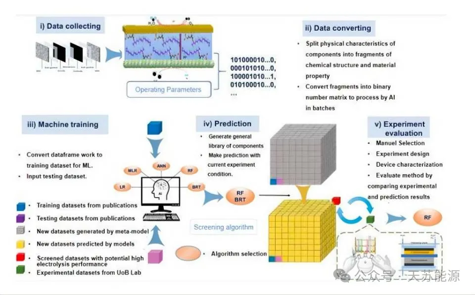
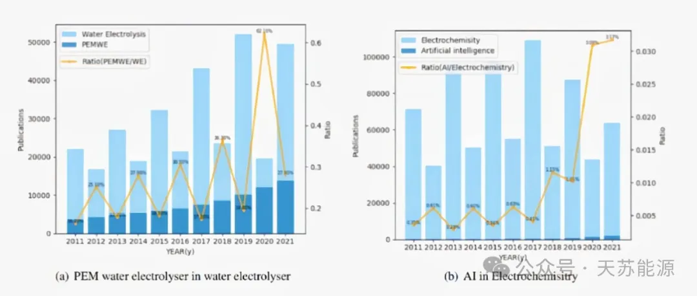
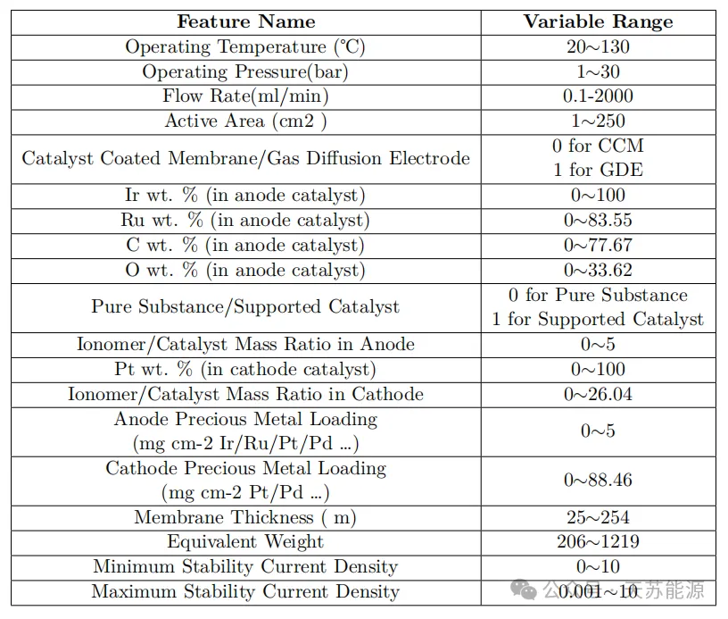
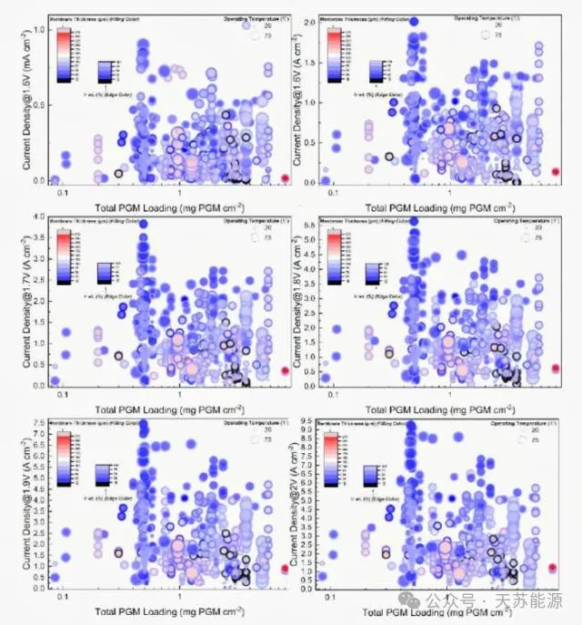
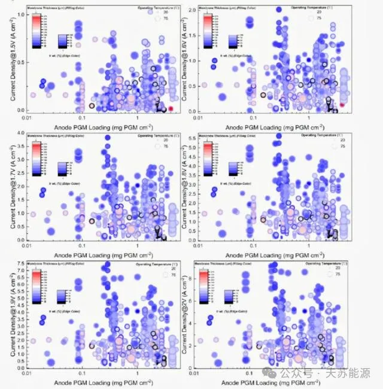
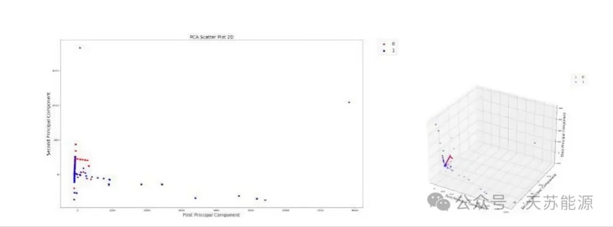
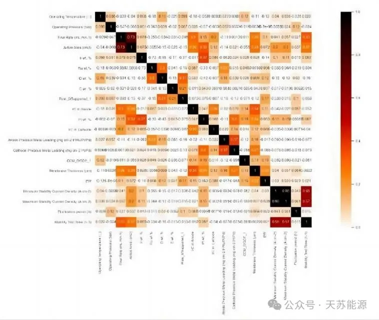
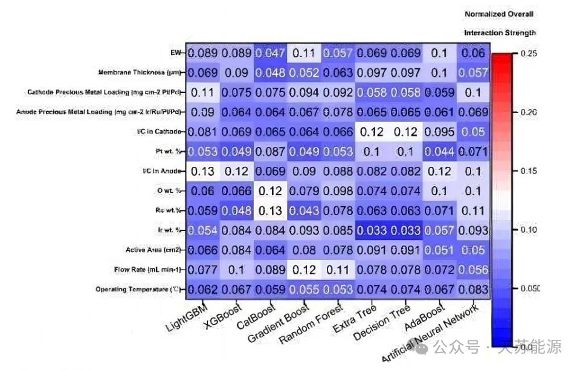

📢 **摘要**

> 质子交换膜水电解(PEMWE)的发展依赖于电力成本的降低和效率、可靠性和耐用性的提高。目前，开发的主要动力依赖于专家经验以及在不同操作条件下通过定制材料进行重复的“反复试错”实验。随着数据科学时代的蓬勃发展，人工智能可以更好地支持水电解行业抓住可再生能源整合的日益增长的机会，储存波动能源，并支持电力系统的高效运行。
> 本研究将质子交换膜水电解器拆解成各个组件，并量化为包含1043个数据集和39,634个数据点的二进制数据矩阵。然后，我们研究机器学习算法是否适合基于这些组件预测膜电极组件性能，以及哪种算法效果最佳。结果表明，随机森林算法的预测精度最高,在电位为1.8V时 ，回归精度R²为 0.83。
> 此外，创新性地运用不同的黑箱解释方法，从机器学习模型中获得对重要参数的洞察，以及它们是否能与以前的研究达成共识，以证明数据驱动模型的可靠性。除了为设计膜电极组件提供新指导外，所提出的机器学习工作流程还可以看作是一种新的研究范式并扩展到其他与能源相关的领域。

## **1.简介**

开发可靠且经济的水电解装置对于实现可再生能源驱动的未来社会至关重要。质子交换膜水电解器 (PEMWE)目前正成为研究人员关注的焦点。这是因为与研究充分的碱性水电解器相比，它们的电流密度更高，气体渗透性更低。此外，还报道了它们的产品纯度和响应率。

  

膜电极组件(MEA)是质子交换膜水电解质的核心部件，也是其成本高昂的重要原因。目前，该系统同时涉及不同尺度的物理化学过程，包括纳米尺度的电化学反应、中观尺度的传质和宏观尺度的热电耦合。大多数研究集中在不同电催化剂的半电池测试及其反应机理，而较少研究关注PEMWE装置的设计和优化。事实上，催化剂负载、离聚物质量分数、膜性能、多孔传输层和操作条件等工程参数将更具决定性。这主要是因为每个参数的测试都涉及大量的时间和资源。实验人员和研究人员不可能严格按照正交试验在高维参数空间下进行性能评估。因此，正交试验是该领域必不可少的。

为了解决这个问题，我们在这项工作中进一步引入了人工智能 (AI)和数据科学领域的机器学习(ML)工 具，以实现对 MEA 性能的快速预测。

在这项工作中，我们根据过去10年的文献综述开发了一个由重要特征组成的数据库。之后，我们将其可视化，然后将其用于整体性能预测，方法是将工作分成几个部分，ML  算法训练并从数据集中学习模式。事实证明，我们的工作提供了更可靠的建议，并可以加速可再生能源相关领域的开发周期(电流密度从1.5到2.0V，间隔为0.05V)。

**2. 方法论**

**2.1 数据库构建**

根据实验人员和研究人员的调查结果，所选的特征可能对整体电极性能产生最显著的影响。在数据库构建过程中，记录了几个初始特征，它们的可变范围可以在下表中看到。详细表格可以在后台留言后中获取。此外，额外的数据来源由电化学模型的开发而实现。

对于喷涂、涂层等工程参数，很难将相关信息数字化并格式化为适合计算机的形式。一种常见的策略是将它们转换为独热编码形式。

在本文中，我们采用了正则表达式，1 表示证明该语句, 0 表示相反。

**2.2 数据库预处理和可视化**

在数据库收集工作中，一些实验条件在文献中没有记载，因此初始数据库中不可避免地存在一些缺失值，而大多数机器学习算法的训练无法在有缺失值的输入矩阵上进行。因此，我们采用一种常见的多重插值方法：迭代插值。其基本思想是将每个具有缺失值的特征建模为其他特征的函数，并使用建模的预测值填充每个缺失值。它以循环迭代的方式实现：在每一步，将特征目标列分配为输出  y，将其他列视为输入 X。使用回归器将(X,y) 拟合到已知(非缺失)的 y ，然后使用回归器预测缺失的 y 值。对于数据库中每个具有缺失值的特征，数据插补均按照上述方式迭代完成。我们可以定义最大迭代次数，即 maxiter，以返回上一轮计算的结果。

我们对一些重要的  MEA  参数(如贵金属(PGM) 负载和相应的输出)的分布模式进行了可视化。图 3 和图 4 分别显示了不同电位和衰减速率下的电流密度数据点的分布。

  

  

从分布上，我们可以大致了解该领域已发表的研究成果，同时大部分研究成果得到了该领域的广泛认可。

如图 4 所示，维数空间非常高，包含许多不重要的信息。通过进一步应用主成分分析(PCA)，我们可以在较低维度上可视化多维数据，从而提高数据的可解释性，同时保留最大信息量。

初始数据库和PCA降维后的数据库都将被作为机器学习算法的输入特征进行研究，以便进行比较。

  

**3. 机器学习算法和实验设置**

在本研究中，我们采用了不同的机器学习算法来研究机器学习是否可以根据收集到的特征来预测 MEA 性能，以及它们在这个问题上的准确性。由于机器学习算法具有在学习过程之前需要预定义的超参数，因此我们应用网格搜索来调整超参数值，找到适合此问题的值。

**4. 结果与讨论**

**4.1 绩效指标**

以前的性能指标是基于机器学习算法的原始设定，但现在基于其他人的文献综述工作的新评估指标已经被用来验证。

**4.2 特征相关性**  

为了得到更简单、全面、直观的结果，我们使用R²和AUC作为权重，考虑了不同ML算法得到的模型在预测性能上的差异，并总结了平均值。从整体结果来看，大多数特征之间没有很强的相互作用，这与领域知识。总体而言，被认为具有非常强相互作用的几种特征组合并不十分现实。因此，这些结果与高电流区域更受关注的模型中的化学直觉一致。结果是，没有任何一对特征具有强烈的线性相关性(超过 0.8)。
  

  

特别是对于与MEA的几何和化学性质直接相关的描述符，明显观察到了独立性。

  

**4.3 机器学习分析结果**

对于ML建模，采用了九种不同的流行ML算法 : LightGBM、XGBoost、CatBoost、梯度提升、随机森林、额外树、决策树、AdaBoost和人工神经网络。

  

虽然我们在这项工作中的主要重点是使用机器学习来实现准确的预测和直观的洞察，而不是基本的数学原理。为了筛选出表现最佳的 ML 模型，使用 "scikit‑learn" 通过五倍交叉验证的网格搜索优化了每个ML算 法的超参数。对于本研究中的每个回归模型，训练集和测试集都是通过随机分割形成的，大小为 85‑15%。在机器学习算法中，R²最小的是  XGBoost，为 0.835，而最大的是梯度提升树，为0.943。这证明了梯度提升树作为预测 MEA 性能的机器学习模型的可行性。

  

**4.4  数据挖掘的PDP分析**

为了进一步从人工智能中获得电化学的洞察力，我们进一步应用偏依赖图(PDP)，这是一种适用于任何机器学习问题的通用解释方法，以帮助研究y 和特征 **X**1之 间的关系。我们首先拟合一个随机森林模型RF(X)，然后使用**X**ik 表示训练集中第k个样本的第i个特征。

**5. 结论**

为了降低成本并提高PEMWE中MEA 的耐用性，传统的优化实验需要大量的反复试验和时间。因此，我们在这项工作中创新性地引入了ML来解决这一问题。从构建数据库开始，我们针对不同的回归/分类任务采用了九种不同的ML算法。最后，我们成功建立了一系列在不同电压和衰减速率下具有可接受电流密度精度的ML 模型。

这些模型可以帮助研究人员在开始实验之前获得初步的性能/耐久性预测，从而加快开发周期。接下来，我们对具有特定物理化学意义的MEA参数进行了输入特征重要性分析。这有助于我们了解这个复杂系统中最关键的因素，并减少后续过程所需的计算量。不仅如此，我们应用了一系列黑箱解释方法，不仅可视化ML模型中输入特征之间的相互作用，还定性分析了诸如阳极电催化剂中Ir的质量分数等变量对模型输出的影响。最后，借助Apriori关联规则挖掘等支持信息挖掘方法，我们获得了一组相互自洽的设计规则。

---

